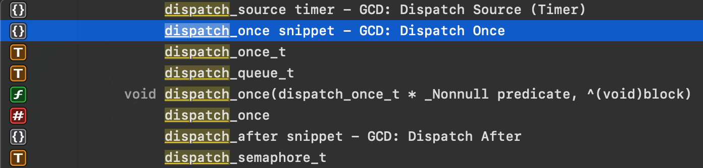
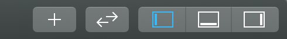
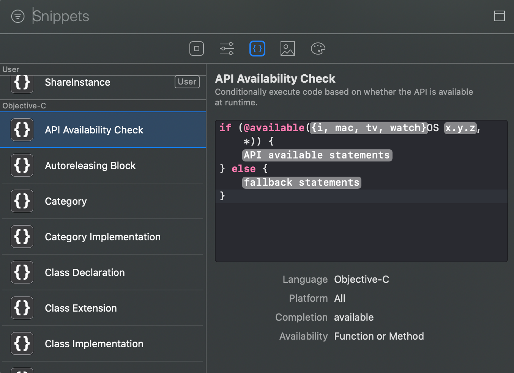
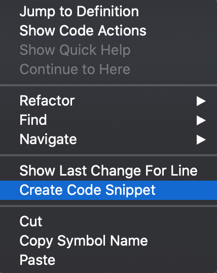
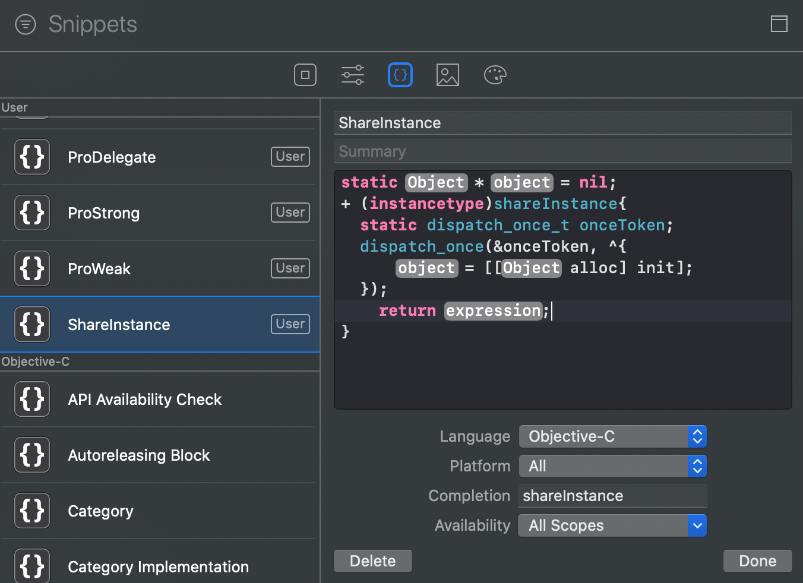
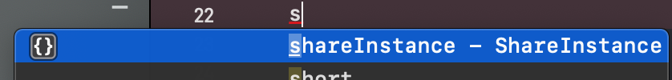

Xcode中有许多小功能，可能经常被使用到，但是却没被发觉，如`Xcode Snippets`。

在敲代码时，经常会遇到刚敲几个字母就会有相应的提示，点击`enter`选中时，代码段立即显示出来，再根据对应的提示进行代码编写，极大地提升了代码的编程效率，如：



带有`{}`图标的均代表有该操作，只需输入几个单词就能完成如下代码的编写。

```
    static dispatch_once_t onceToken;
    dispatch_once(&onceToken, ^{
        <#code to be executed once#>
    });

```

以上实例就是`Xcode Snippets`的应用，这是Xcode自带的一些`Code Snippet`，我们也可以自定义接下来将通过一些实例自定义一些常见的`Code Snippet`。


## 查找`Code Snippet`

Xcode中默认自带一些常见的`Code Snippet`，通过以下方式可以快速打开`Code Snippet`:

- 1、快捷键`cmd + shift + L`
- 2、点击Xcode右上角的工具栏中的`+`,如下图所示：

    

按照上述其中之一操作后，即可显示如下界面：



通过输入对应的字段即可查找相关的`Code Snippet`.

## 新增自定义`Code Snippet`

在Xcode中，通过在源文件中右键，并点击`Create Code Snippet`,即可快速创建代码段，如下图所示：



打开面板后，通过输入对应的name、Completion,即可完成代码段的新建，如下图所示：



其中`Completion`代表代码段的简写，通过在编码时快速输入该简写，达到展示代码段的目的，如下所示：




## 自定义常见的`Code Snippet`
可以将平时用经常用到，但又都是大量重读性的代码自定义成代码段，提高编写效率。如常见的属性声明、固定值等

**01、属性声明：**

```
//Strong
@property (nonatomic, strong) <#Class#> *<#object#>;
//Weak
@property (nonatomic, weak) <#Class#> *<#object#>;
//assign
@property (nonatomic, assign) <#Class#> <#property#>;
//copy
@property (nonatomic, copy) NSString *<#string#>;
//delegate
@property (nonatomic, weak) id<<#protocol#>> <#delegate#>;
//Block声明
@property (nonatomic, copy) <#returnType#>(^<#blockName#>)(<#arguments#>);

```
**02、固定值**
罗列部分，根据需要增加

| 含义 | Completion | 代码段 |
|----|----|----|
| 屏幕宽度 | ksw | [UIScreen mainScreen].bounds.size.width; |
| 屏幕高度 | ksh | [UIScreen mainScreen].bounds.size.height; |

**03、单例**

## 共享代码段

针对自定义的一些代码段会被存放在`~/Library/Developer/Xcode /UserData/CodeSnippets/`目录下，可以备份对应的文件，以便切换电脑时复用。
