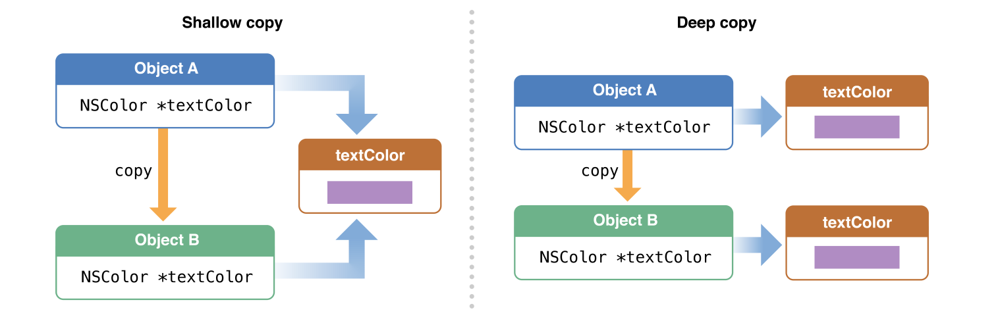

# iOS内存管理之深拷贝和浅拷贝

​	浅拷贝和深拷贝是一个很常见的问题，无论是在平时的开发过程中，还是在面试时，几乎都会遇到，当被问到该问题时，大部分的人都会回答说浅拷贝是指针的拷贝，深拷贝是内容的拷贝，这样回答当然没错，但如果被进一步问到浅拷贝和深拷贝是如何实现的呢？对象中的属性是如何拷贝的？集合的拷贝以及集合中的对象如何拷贝呢？等等，如果对以上的问题有些许疑惑，接下来我们一起探索一下。

​	首先，对象的拷贝涉及到两个方法`copy`和`mutableCopy`,	如果自定义的对象使用这个两个方法，首先需要遵守`NSCopying`、`NSMutableCopying`协议，并实现各自对应的方法`copyWithZone:`和`mutableCopyWithZone:`通过运行时的源码`NSObject.mm`中，可以了解到两者的实现如下：

```
+ (id)copyWithZone:(struct _NSZone *)zone {
    return (id)self;
}

- (id)copy {
    return [(id)self copyWithZone:nil];
}

+ (id)mutableCopyWithZone:(struct _NSZone *)zone {
    return (id)self;
}

- (id)mutableCopy {
    return [(id)self mutableCopyWithZone:nil];
}
```

`copy`和`mutableCopy`两个方法只是简单的调用了`copyWithZone:`和`mutableCopyWithZone:`。两者的区别`copy`方法用于复制对象的副本。通常来说，copy方法总是返回对象的不可修改的副本，即使对象本身是可修改的。例如，NSMutableString调用copy方法，将会返回不可修改的字符串对象。`mutableCopy`方法用于复制对象的可变副本。通常来说，`mutableCopy`方法总是返回对象可修改的副本，即使被复制的对象本身是不可修改的。

[Apple官方](https://developer.apple.com/library/archive/documentation/General/Conceptual/DevPedia-CocoaCore/ObjectCopying.html)针对浅拷贝和深拷贝的示意图如下：



通过示意图可以初步了解到：浅拷贝的对象指向同一个地址，即指针的拷贝；深拷贝的对象指向不同的地址，即内容的拷贝。

Talk is cheap, show me the code.接下来通过具体的实践进一步了解分析`NSString`、`NSMutableString`以及自定义对象`TestModel`的拷贝:

## NSString

```objective-c
// NSString
- (void)testStringCopy{
    NSString *str = @"original value";
    NSString *copyStr = [str copy];
    NSMutableString *mutableCopyStr = [str mutableCopy];
    NSLog(@"地址:%p 值:%@", str, str);
    NSLog(@"地址:%p 值:%@", copyStr, copyStr);
    NSLog(@"地址:%p 值:%@", mutableCopyStr, mutableCopyStr);
}
```

打印结果为：

```
2020-10-24 13:43:08.105253+0800 内存管理[33986:1618628] 地址:0x10cdcd160 值:original value
2020-10-24 13:43:08.105371+0800 内存管理[33986:1618628] 地址:0x10cdcd160 值:original value
2020-10-24 13:43:08.105490+0800 内存管理[33986:1618628] 地址:0x600000433e10 值:original value
```

## NSMutableString

```
//NSMutableString
- (void)testMutableCopy{
    NSMutableString *str = [NSMutableString stringWithString:@"original value"];
    NSMutableString *copyStr = [str copy];
    NSMutableString *mutableCopyStr = [str mutableCopy];
    NSLog(@"地址:%p 值:%@", str, str);
    NSLog(@"地址:%p 值:%@", copyStr, copyStr);
    NSLog(@"地址:%p 值:%@", mutableCopyStr, mutableCopyStr);
}
```

打印结果为：

```
2020-10-24 13:43:08.105712+0800 内存管理[33986:1618628] 地址:0x600000439fb0 值:original value
2020-10-24 13:43:08.105815+0800 内存管理[33986:1618628] 地址:0x600000a30820 值:original value
2020-10-24 13:43:08.105939+0800 内存管理[33986:1618628] 地址:0x60000043a2e0 值:original value
```

通过以上结果分析可知：

- 非可变字符串`NSString`通过`copy`对象后，生成的对象与原对象指向同一个地址，属于浅拷贝；通过`mutableCopy`生成的对象与原对象指向不同的地址，属于深拷贝。
- 可变字符串`NSMutableString`无论是通过`copy`还是`mutableCopy`，生成的对象均指向不同的地址，属于深拷贝。

## TestModel对象的拷贝

针对`TestModel`为测试对象的拷贝，以及对象的拷贝对其属性的影响。源码如下：

```
//TestModel.h

#import <Foundation/Foundation.h>

NS_ASSUME_NONNULL_BEGIN

@interface TestModel : NSObject

@property (nonatomic, copy) NSString *title;
@property (nonatomic, copy) NSMutableString *subTitle;
@property (nonatomic, strong) NSArray *norArray;
@property (nonatomic, strong) NSMutableArray *mutArray;

- (instancetype)initWithTitle:(NSString *)title subTitle:(NSMutableString *)subTitle norArray:(NSArray *)array mutArrry:(NSMutableArray *)mutArray;

@end

NS_ASSUME_NONNULL_END
```

```
// TestModel.m
#import "TestModel.h"

@interface TestModel()<NSCopying, NSMutableCopying>

@end

@implementation TestModel

- (instancetype)initWithTitle:(NSString *)title subTitle:(NSMutableString *)subTitle norArray:(NSArray *)array mutArrry:(NSMutableArray *)mutArray{
    if (self = [super init]) {
        _title = title;
        _subTitle = subTitle;
        _norArray = array;
        _mutArray = mutArray;
    }
    return self;
}

- (id)copyWithZone:(nullable NSZone *)zone{
    TestModel *model = [[[self class] allocWithZone:zone] init];
    model.title = [self.title copyWithZone:zone];       //同[self.title copy];
    model.subTitle = [self.subTitle copyWithZone:zone]; //同[self.subTitle copy];
    model.norArray = [self.norArray copyWithZone:zone]; //同[self.norArray copy];
    model.mutArray = [self.mutArray copyWithZone:zone]; //同[self.mutArray copy];
    return model;
}
// 如果对象属性特别多的情况下，可以使用runtime实现，如下：

/*
- (id)copyWithZone:(NSZone * )zone{
    id copyObject = [[[self class] allocWithZone:zone] init];
    // 01:获取属性列表
    unsigned int propertyCount = 0;
    objc_property_t *propertyArray = class_copyPropertyList([self class], &propertyCount);
    for (int i = 0; i< propertyCount; i++) {
        objc_property_t  property = propertyArray[i];
        // 2.属性名字
        const char * propertyName = property_getName(property);
        NSString * key = [NSString stringWithUTF8String:propertyName];
        // 3.通过属性名拿到属性值
        id value=[self valueForKey:key];
        NSLog(@"name:%s,value:%@",propertyName,value);
        // 4.判断值对象是否响应copyWithZone
        if ([value respondsToSelector:@selector(copyWithZone:)]) {
            //5.设置属性值
            [copyObject setValue:[value copy] forKey:key];
        }else{
            [copyObject setValue:value forKey:key];
        }
    }
    //mark:需要手动释放
    free(propertyArray);
    return copyObject;
}
*/

- (id)mutableCopyWithZone:(NSZone *)zone{
    TestModel *model = [[[self class] allocWithZone:zone] init];
    model.title = [self.title mutableCopyWithZone:zone];        // 同[self.title mutableCopy];
    model.subTitle = [self.subTitle mutableCopyWithZone:zone];  // 同[self.subTitle  mutableCopy];
    model.norArray = [self.norArray mutableCopyWithZone:zone];  // 同[self.norArray mutableCopy];
    model.mutArray = [self.mutArray mutableCopyWithZone:zone];  // 同[self.mutArray mutableCopy];
    return model;
}
// 如果对象属性特别多的情况下，可以使用runtime实现，如下：

/*
- (id)mutableCopyWithZone:(NSZone *)zone{
    id mutableCopyObj = [[[self class]allocWithZone:zone] init];
    //1.获取属性列表
    unsigned int count = 0;
    objc_property_t* propertylist = class_copyPropertyList([self class], &count);
    for (int i = 0; i < count ; i++) {
        objc_property_t property = propertylist[i];
        //2.获取属性名
        const char * propertyName = property_getName(property);
        NSString * key = [NSString stringWithUTF8String:propertyName];
        //3.获取属性值
        id value = [self valueForKey:key];
        //4.判断属性值对象是否遵守NSMutableCopying协议
        if ([value respondsToSelector:@selector(mutableCopyWithZone:)]) {
            //5.设置对象属性值
            [mutableCopyObj setValue:[value mutableCopy] forKey:key];
        }else{
            [mutableCopyObj setValue:value forKey:key];
        }
    }
    //mark:需要手动释放
    free(propertylist);
    return mutableCopyObj;
}
*/

@end
```

测试代码：

```
- (void)testCustomObject{
    NSMutableArray *mutableArray = [NSMutableArray array];
    TestModel *model = [[TestModel alloc] initWithTitle:@"title" subTitle:[NSMutableString stringWithString:@"subTitle"] norArray:@[@"test1", @"test2"] mutArrry:mutableArray];
    TestModel *copyModel = [model copy];
    TestModel *mutableModel = [model mutableCopy];
    // 测试对象的拷贝
    NSLog(@"******TestModel内存地址******");
    NSLog(@"原始地址：%p", model);
    NSLog(@"copy地址：%p", copyModel);
    NSLog(@"mutableCopy地址：%p", mutableModel);
    // 测试对象拷贝对NSString类型属性的影响
    NSLog(@"******  属性title(NSString)内存地址  ******");
    NSLog(@"原始地址：%p", model.title);
    NSLog(@"copy地址：%p", copyModel.title);
    NSLog(@"mutableCopy地址：%p", mutableModel.title);
    // 测试对象拷贝对NSMutableString类型属性的影响
    NSLog(@"****** 属性subTitle(NSMutableString)内存地址 ******");
    NSLog(@"原始地址：%p", model.subTitle);
    NSLog(@"copy地址：%p", copyModel.subTitle);
    NSLog(@"mutableCopy地址：%p", mutableModel.subTitle);
    // 测试对象拷贝对非可变集合类型属性的影响
    NSLog(@"****** 属性norArray(NSArray)内存地址 ******");
    NSLog(@"原始地址：%p", model.norArray);
    NSLog(@"copy地址：%p", copyModel.norArray);
    NSLog(@"mutableCopy地址：%p", mutableModel.norArray);
    // 测试对象拷贝对可变几何类型属性的影响
    NSLog(@"****** 属性mutArrry(NSMutableArray)内存地址 ******");
    NSLog(@"原始地址：%p", model.mutArray);
    NSLog(@"copy地址：%p", copyModel.mutArray);
    NSLog(@"mutableCopy地址：%p", mutableModel.mutArray);
}
```

打印结果如下：

```
2020-10-25 15:40:28.564704+0800 内存管理[39368:1919107] ******TestModel内存地址******
2020-10-25 15:40:28.564882+0800 内存管理[39368:1919107] 原始地址：0x600000eaa400
2020-10-25 15:40:28.564988+0800 内存管理[39368:1919107] copy地址：0x600000eaa370
2020-10-25 15:40:28.565097+0800 内存管理[39368:1919107] mutableCopy地址：0x600000eaa100

2020-10-25 15:40:28.565191+0800 内存管理[39368:1919107] ******  属性title(NSString)内存地址  ******
2020-10-25 15:40:28.565468+0800 内存管理[39368:1919107] 原始地址：0x10e8f5188
2020-10-25 15:40:28.565923+0800 内存管理[39368:1919107] copy地址：0x10e8f5188
2020-10-25 15:40:28.566376+0800 内存管理[39368:1919107] mutableCopy地址：0x8356f4dfe5d0308a

2020-10-25 15:40:28.566881+0800 内存管理[39368:1919107] ****** 属性subTitle(NSMutableString)内存地址 ******
2020-10-25 15:40:28.569415+0800 内存管理[39368:1919107] 原始地址：0x600000eaa430
2020-10-25 15:40:28.578373+0800 内存管理[39368:1919107] copy地址：0x8355e20852d2afc7
2020-10-25 15:40:28.578531+0800 内存管理[39368:1919107] mutableCopy地址：0x8355e20852d2afc7

2020-10-25 15:40:28.578646+0800 内存管理[39368:1919107] ****** 属性norArray(NSArray)内存地址 ******
2020-10-25 15:40:28.578771+0800 内存管理[39368:1919107] 原始地址：0x6000000a9780
2020-10-25 15:40:28.579093+0800 内存管理[39368:1919107] copy地址：0x6000000a9780
2020-10-25 15:40:28.579223+0800 内存管理[39368:1919107] mutableCopy地址：0x600000eaa310

2020-10-25 15:40:28.579318+0800 内存管理[39368:1919107] ****** 属性mutArrry(NSMutableArray)内存地址 ******
2020-10-25 15:40:28.579674+0800 内存管理[39368:1919107] 原始地址：0x600000eaa0d0
2020-10-25 15:40:28.580027+0800 内存管理[39368:1919107] copy地址：0x7fff8062cc40
2020-10-25 15:40:28.580466+0800 内存管理[39368:1919107] mutableCopy地址：0x600000eaa3d0

```

通过以上测试可以发现：

- 针对对象的拷贝，无论是`copy`还是`mutableCopy`都会产生新的对象，均为深拷贝。
- 对象中的属性，遵循可变类型的属性无论是`copy`还是`mutableCopy`都会产生新的对象，均为深拷贝；非可变类型的属性，`copy`时没有产生新的对象，为指针拷贝，即浅拷贝；`mutableCopy`时产生新的对象，为内容拷贝，即深拷贝。

## 集合的的拷贝

针对集合的拷贝，[Apple官方](https://developer.apple.com/library/archive/documentation/Cocoa/Conceptual/Collections/Articles/Copying.html)给的示意图如下：


之所以将集合对象拿出来单独处理，原因在于集合中会包含很多的对象，这些对象也需要区分深拷贝与浅拷贝，更深一些，集合中也可能包含集合对象，如此一来，显得更加麻烦。接下来将以`NSArray`的深拷贝与浅拷贝，将集合的深浅拷贝分为四种情况进一步了解：

### 1、浅拷贝

**代码如下：**

```
    NSArray *oriArr = [NSArray arrayWithObjects:@"test", nil];
    NSArray *copyArr = [oriArr copy];
    NSLog(@"%p", oriArr);
    NSLog(@"%p", copyArr);
```

**日志分析：**

```
// 通过日志分析可以确定为浅拷贝
2020-10-25 16:59:33.093252+0800 内存管理[39941:1967202] 0x600002fafa60
2020-10-25 16:59:33.093358+0800 内存管理[39941:1967202] 0x600002fafa60
```

### 2、单层深拷贝

单层深拷贝指的是对`NSArray`对象的深拷贝，并非对其内部的元素进行处理。

**代码如下：**

```
NSArray *oriArr = [NSArray arrayWithObjects:@"test", nil];
NSMutableArray *mutArr = [oriArr mutableCopy];
NSLog(@"%p", oriArr);
NSLog(@"%p", mutArr);
//内部元素
NSLog(@"%p", oriArr[0]);
NSLog(@"%p", mutArr[0]);
```

**日志分析：**

```
// 通过日志分析可以发现，NSArray对象通过mutableCopy进行了深拷贝，但是其内部元素并没有完全深拷贝，因此称为单层深拷贝
2020-10-25 17:08:32.338871+0800 内存管理[40113:1978516] 0x60000223cb60
2020-10-25 17:08:32.338960+0800 内存管理[40113:1978516] 0x600002c5d380
2020-10-25 17:08:32.339046+0800 内存管理[40113:1978516] 0x10af9b4e8
2020-10-25 17:08:32.339134+0800 内存管理[40113:1978516] 0x10af9b4e8
```

### 3、双层深拷贝

```
- (void)testCollectionCopy{ 
		// 创建
    NSMutableString *mutString1 = [NSMutableString stringWithString:@"test1"];
    NSMutableString *mutString2 = [NSMutableString stringWithString:@"test2"];
    NSMutableArray *mutableArr = [NSMutableArray arrayWithObjects:mutString2, nil];
    NSArray *testArr = [NSArray arrayWithObjects:mutString1, mutableArr, nil];
    //通过官方文档提供的方式进行创建copy
    NSArray *testArrCopy = [[NSArray alloc] initWithArray:testArr copyItems:YES];
    //testArr和testArrCopy进行对比
    NSLog(@"===我是分割线01===");
    NSLog(@"%p", testArr);
    NSLog(@"%p", testArrCopy);
    
    //testArr和testArrCopy中元素指针对比
    //mutableString对比
    NSLog(@"===我是分割线02===");
    NSLog(@"%p", testArr[0]);
    NSLog(@"%p", testArrCopy[0]);
    
    //mutableArr对比
    NSLog(@"===我是分割线03===");
    NSLog(@"%p", testArr[1]);
    NSLog(@"%p", testArrCopy[1]);
    
    //mutableArr中元素对比，即mutString2进行对比
    NSLog(@"===我是分割线04===");
    NSLog(@"%p", testArr[1][0]);
    NSLog(@"%p", testArrCopy[1][0]);
}
```

日志分析：

```
2020-10-25 17:35:01.731301+0800 内存管理[40436:1999803] ===我是分割线01===
2020-10-25 17:35:01.734516+0800 内存管理[40436:1999803] 0x60000147a2c0
2020-10-25 17:35:01.734661+0800 内存管理[40436:1999803] 0x60000147a2e0
2020-10-25 17:35:01.734784+0800 内存管理[40436:1999803] ===我是分割线02===
2020-10-25 17:35:01.734964+0800 内存管理[40436:1999803] 0x600001a528b0
2020-10-25 17:35:01.735420+0800 内存管理[40436:1999803] 0x87c4312271f96ce5
2020-10-25 17:35:01.735838+0800 内存管理[40436:1999803] ===我是分割线03===
2020-10-25 17:35:01.736861+0800 内存管理[40436:1999803] 0x600001a52550
2020-10-25 17:35:01.738048+0800 内存管理[40436:1999803] 0x600001627300
2020-10-25 17:35:01.738733+0800 内存管理[40436:1999803] ===我是分割线04===
2020-10-25 17:35:01.738939+0800 内存管理[40436:1999803] 0x600001a524c0
2020-10-25 17:35:01.739575+0800 内存管理[40436:1999803] 0x600001a524c0
```

通过以上日志可以发现：copy后，只有mutableArr中的mutalbeString2指针地址没有变化。而testArr的指针和testArr中的mutableArr、mutableString1的指针地址均发生变化，所以称之为双层深复制。

**限制**

initWithArray: copyItems:会使NSArray中元素均执行copy方法，这也是在testArr中放入NSMutableArray和NSMutableString的原因。如果放入的是NSArray或者NSString，执行copy后，只会发生指针复制；如果放入的是未实现NSCopying协议的对象，调用这个方法甚至会crash。

### 4、完全深拷贝

如果想完美的解决NSArray嵌套NSArray这种情形，可以使用归档、解档的方式。

**代码如下：**

```objective-c
- (void)testDeepCopyCollection{
    NSMutableString *mutString1 = [NSMutableString stringWithString:@"test1"];
    NSMutableString *mutString2 = [NSMutableString stringWithString:@"test1"];
    NSMutableArray *mutableArr = [NSMutableArray arrayWithObjects:mutString2, nil];
    NSArray *testArr = [NSArray arrayWithObjects:mutString1, mutableArr, nil];
    //通过归档、解档的方式创建copy
    NSArray *testArrCopy = [NSKeyedUnarchiver unarchiveObjectWithData:[NSKeyedArchiver archivedDataWithRootObject:testArr]];
    //testArr和testArrCopy进行对比
    NSLog(@"===我是分割线01===");
    NSLog(@"%p", testArr);
    NSLog(@"%p", testArrCopy);
   
    //testArr和testArrCopy中元素指针对比
    //mutableString对比
    NSLog(@"===我是分割线02===");
    NSLog(@"%p", testArr[0]);
    NSLog(@"%p", testArrCopy[0]);
   
    //mutableArr对比
    NSLog(@"===我是分割线03===");
    NSLog(@"%p", testArr[1]);
    NSLog(@"%p", testArrCopy[1]);
   
    //mutableArr中元素对比，即mutalbeString2进行对比
    NSLog(@"===我是分割线04===");
    NSLog(@"%p", testArr[1][0]);
    NSLog(@"%p", testArrCopy[1][0]);
}
```

日志：

```
2020-10-25 21:14:30.738233+0800 内存管理[41176:2082596] ===我是分割线01===
2020-10-25 21:14:30.738370+0800 内存管理[41176:2082596] 0x60000173a480
2020-10-25 21:14:30.738475+0800 内存管理[41176:2082596] 0x60000173a660
2020-10-25 21:14:30.738575+0800 内存管理[41176:2082596] ===我是分割线02===
2020-10-25 21:14:30.738670+0800 内存管理[41176:2082596] 0x600001950780
2020-10-25 21:14:30.738766+0800 内存管理[41176:2082596] 0x600001950990
2020-10-25 21:14:30.738965+0800 内存管理[41176:2082596] ===我是分割线03===
2020-10-25 21:14:30.745114+0800 内存管理[41176:2082596] 0x6000019507e0
2020-10-25 21:14:30.745286+0800 内存管理[41176:2082596] 0x600001950a50
2020-10-25 21:14:30.745426+0800 内存管理[41176:2082596] ===我是分割线04===
2020-10-25 21:14:30.745631+0800 内存管理[41176:2082596] 0x6000019507b0
2020-10-25 21:14:30.745943+0800 内存管理[41176:2082596] 0x600001950a80
```

通过以上日志发现，`testArr`和`testArrCopy`中的元素以及集合中集合的指针完全不同，所以完成了深拷贝。

**限制**

归档和解档的前提是NSArray中所有的对象都实现了NSCoding协议。

## 总结

以上就是关于深拷贝和浅拷贝的一些探究，概括为浅拷贝为指针的复制，不会创建一个对象；深拷贝为内容的复制，会创建一个新的对象，集合的拷贝需要多加注意，以免引起一些问题。在平时的项目开发中，需要根据需要而决定使用深拷贝还是浅拷贝。


## 参考文档:

- [对象的拷贝](https://developer.apple.com/library/archive/documentation/General/Conceptual/DevPedia-CocoaCore/ObjectCopying.html)
- [集合的拷贝](https://developer.apple.com/library/archive/documentation/Cocoa/Conceptual/Collections/Articles/Copying.html)
- [iOS Copy](https://www.jianshu.com/p/ebbac2fec4c6)