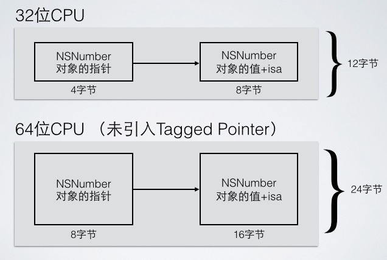
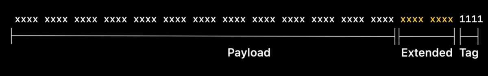

# 内存管理

> 为什么需要内存管理？原因在于如果没有内存管理，程序在运行的过程中不但不能释放不再使用的内存，而且还会不停地分配内存，这样占用的内存就会越来越多，程序速度也会越来越慢，最后甚至会因为内存耗尽而崩溃，因此需要妥善管理内存。
>
> 内存消耗: 当应用程序启动后，除了代码和系统数据会消耗一部分内存外，开发者在程序中创建的任何对象都会消耗内存。

 ##  内存分区

在iOS程序中，内存通常被分为如下5个区域（内核区及保留区暂不探讨）：

- 栈区（stack）：栈用于维护函数调用的上下文，离开了栈，函数调用就没法实现，栈保存了一个函数调用所需要维护的信息，这些信息通常被称为堆栈帧。由编译器自动分配释放，存放函数的参数值，局部变量的值等，操作方式类似于数据结构中的栈，属于线性结构，内存连续。栈通常在内存空间的最高地址处分配，通常有数兆字节的大小。

- 堆区（heap）：堆是用来容纳应用动态程序动态分配的内存区域， 如`Objective-C`中`new` 、`alloc` 创建的对象， 由程序员分配释放，如果程序员不释放，在程序结束时由OS回收。属于链式结构，内存不连续，由于是动态分配，因此编译时不能提前确定。注意该堆区与数据结构中的堆是两码事。

- BSS区(全局区、静态区)：全局变量和静态变量的存储是放在一块的。**初始化的**全局变量和静态变量在一块区域，**未初始化的**全局变量和静态变量在相邻的另一块区域。

- 常量区：存储一些常量，如常量字符串等。

- 代码区：用于存放程序运行时的代码，代码会被编译成二进制存进内存的程序代码区。

  以上5个内存分区中，除了堆区需要开发者手动进行内存管理外，其他区域都在程序结束后，由系统释放。

  接下来通过代码进一步探索常用的数据存放的区域：

  **栈区：**通常存放一些指针及常见的数据类型，地址以`ox7`开始。

  ```objective-c
      // 栈区示例
      int a = 0;
      NSUInteger b = 1;
      NSNumber *c = @3;
      NSObject *obj = [[NSObject alloc] init];
      NSLog(@"a的地址:%p", &a);
      NSLog(@"b的地址:%p", &b);
      NSLog(@"c的地址:%p", &c);
      NSLog(@"obj的地址:%p", &obj);
      NSLog(@"a占用的内存：%lu",sizeof(a));
      NSLog(@"c占用的内存：%lu",sizeof(c));
      NSLog(@"obj占用的内存：%lu",sizeof(&obj));
  ```

  打印如下：

  ```objective-c
  2020-10-17 21:34:12.366339+0800 内存管理[18451:645349] a的地址:0x7ffee0b241dc
  2020-10-17 21:34:12.366620+0800 内存管理[18451:645349] b的地址:0x7ffee0b241d0
  2020-10-17 21:34:12.367156+0800 内存管理[18451:645349] c的地址:0x7ffee0b241c8
  2020-10-17 21:34:12.367313+0800 内存管理[18451:645349] obj的地址:0x7ffee0b241c0
  2020-10-17 21:34:12.367439+0800 内存管理[18451:645349] a占用的内存：4
  2020-10-17 21:34:12.367706+0800 内存管理[18451:645349] c占用的内存：8
  2020-10-17 21:34:12.367972+0800 内存管理[18451:645349] obj占用的内存：8
  ```

  **堆区：**一般用于存放`alloc` 、`new`等创建的对象，地址以`0x6`开始

  ```objective-c
      NSObject *obj1 = [NSObject new];
      NSObject *obj2 = [[NSObject alloc] init];
      Person *person1 = [[Person alloc] init];
      Person *person2 = [person1 copyWithZone: NULL];
      NSLog(@"obj1 = %@", obj1);
      NSLog(@"obj2 = %@", obj2);
      NSLog(@"person1 = %@", person1);
      NSLog(@"person2 = %@", person2);
  ```

  打印如下：

  ```
  2020-10-17 22:52:45.182268+0800 内存管理[19235:684688] obj1 = <NSObject: 0x600001edc3e0>
  2020-10-17 22:52:45.182403+0800 内存管理[19235:684688] obj2 = <NSObject: 0x600001edc3f0>
  2020-10-17 22:52:45.182559+0800 内存管理[19235:684688] person1 = <Person: 0x600001edc410>
  2020-10-17 22:52:45.182868+0800 内存管理[19235:684688] person2 = <Person: 0x600001edc430>
  ```

  **BSS区**

  ```objective-c
    // 未初始化
    int m;
    static int n;
    static NSString *str1;
    // 已初始化
    int p = 1;
    static int q = 2;
    static NSString *str2 = @"test";
  ```

  打印如下：

  ```objective-c
  2020-10-17 23:44:26.326518+0800 内存管理[19834:721060] m = 0x103e3b778
  2020-10-17 23:44:26.327054+0800 内存管理[19834:721060] n = 0x103e3b780
  2020-10-17 23:44:26.327252+0800 内存管理[19834:721060] str1 = 0x103e3b788
  2020-10-17 23:44:26.327944+0800 内存管理[19834:721060] p = 0x103e3b5e0
  2020-10-17 23:44:26.328244+0800 内存管理[19834:721060] q = 0x103e3b5f0
  2020-10-17 23:44:26.328675+0800 内存管理[19834:721060] str2 = 0x103e3b5e8
  ```


> 当一个 app 启动后，全局区、常量区、代码区的大小就已经固定，因此指向这些区的指针不会产生崩溃性的错误。而堆区和栈区是时时刻刻变化的（堆的创建销毁，栈的弹入弹出），所以当使用一个指针指向这个区里面的内存时，一定要注意内存是否已经被释放，否则会产生程序崩溃（也即是野指针报错）。


## 内存管理方案

内存管理方案可以理解为内存优化方案，是Apple针对系统架构的演变而提出的一系列优化内存的解决方案。iOS的内存管理方案有三种：

### 一、Tagged Pointer

> 在2013年9月，Apple发布了iPhone5S，而5S是首部采用64位架构的A7双核处理器，为了节省内存和提高执行效率，Apple提出了`Tagged Pointer`的概念，可以在[WWDC2013 Advances in Objective-C Session 404](https://developer.apple.com/videos/play/wwdc2013/404/)了解。

#### 概述

关于`Tagged Pointer`,Apple官方给出的解释如下图：

业内大佬[唐巧](https://blog.devtang.com)有一篇文章[深入理解Tagged Pointer](https://blog.devtang.com/2014/05/30/understand-tagged-pointer/)有了详细的描述，有兴趣的可以去阅读下。这里可以概括下：Apple引入`Tagged Pointer`原因是从32位机器迁移到64位的机器上，虽然逻辑没有任何变化，但是像这种简单的数据类型如NSNumber、NSDate以及NSString类型（简短的字符串）一类对象所占的内存会翻倍。正常情况下，如果这个整数只是一个 NSInteger 的普通变量，那么它所占用的内存是与 CPU 的位数有关，在 32 位 CPU 下占 4 个字节，在 64 位 CPU 下是占 8 个字节的。而指针类型的大小通常也是与 CPU 位数相关，一个指针所占用的内存在 32 位 CPU 下为 4 个字节，在 64 位 CPU 下也是 8 个字节。通过以下两张图更直观的了解下：

​		**未引入`Tagged Pointer`时：**



​	**引入`Tagged Pointer`后：**


通过以上的初步了解可以知道：

- `Tagged Pointer`是专门用来存储小的对象，例如NSNumber和NSDate；
- `Tagged Pointer`指针的值不再是地址了，而是真正的值。因此，实际上它不再是一个对象，可以称为**伪指针** ，它的内存并不存在堆中，因此不需要`malloc`和`free`。
- `NSNumber`等对象的值直接存储在了指针中，不必在堆上为其分配内存，节省了很多内存开销。在性能上，有着 3 倍空间效率的提升以及 106 倍创建和销毁速度的提升。

> 备注：需要在Xcode中target对应的Edit Scheme->Arguments->Environment Variables中关闭`Tagged Pointer`的数据混淆，即通过设置环境变量`OBJC_DISABLE_TAG_OBFUSCATION`为`YES`，以方便调试程序。可以在objc-env.h文件中找到更多环境变量。

示例如下：

```
        NSNumber *num1 = @1;
        NSNumber *num2 = @2;
        NSNumber *num3 = @3;
        NSNumber *num4 = @(0xEFFFFFFFFFFFFFFF);
```

打印：

```
// 最后一位为标志位2
2020-11-02 23:44:33.593252+0800 内存管理[21187:644448] 0xb000000000000012
2020-11-02 23:44:33.593884+0800 内存管理[21187:644448] 0xb000000000000022
2020-11-02 23:44:33.594003+0800 内存管理[21187:644448] 0xb000000000000032
2020-11-02 23:44:33.594244+0800 内存管理[21187:644448] 0x600003260000
```

通过以上实例可知，NSNumber在数值小的情况下，确实将值存在了指针中，当8字节可以承载用于表示的数值时，系统就会以Tagged Pointer的方式生成指针，如果8字节承载不了时，则又以以前的方式来生成普通的指针。

有了初步了解后，接下来进一步探究Tagged Pointer原理：

#### Tagged Pointer进一步探究

##### Tagged Pointer的创建

在runtime源码对应的头文件`objc-internal.h`中，有个`_objc_makeTaggedPointer`的函数，该函数说明了`Tagged Pointer`的创建:

```
// 创建（代码经过整理）
static inline void * _Nonnull
_objc_makeTaggedPointer(objc_tag_index_t tag, uintptr_t value)
{
    if (tag <= OBJC_TAG_Last60BitPayload) {
        uintptr_t result =
            (_OBJC_TAG_MASK | 
             ((uintptr_t)tag << _OBJC_TAG_INDEX_SHIFT) | 
             ((value << _OBJC_TAG_PAYLOAD_RSHIFT) >> _OBJC_TAG_PAYLOAD_LSHIFT));
        return _objc_encodeTaggedPointer(result); // 编码
    } else {
        uintptr_t result =
            (_OBJC_TAG_EXT_MASK |
             ((uintptr_t)(tag - OBJC_TAG_First52BitPayload) << _OBJC_TAG_EXT_INDEX_SHIFT) |
             ((value << _OBJC_TAG_EXT_PAYLOAD_RSHIFT) >> _OBJC_TAG_EXT_PAYLOAD_LSHIFT));
        return _objc_encodeTaggedPointer(result); //
    }
}

// 编码
static inline void * _Nonnull
_objc_encodeTaggedPointer(uintptr_t ptr)
{
    return (void *)(objc_debug_taggedpointer_obfuscator ^ ptr);
}
// 解码
static inline uintptr_t
_objc_decodeTaggedPointer(const void * _Nullable ptr)
{
    return (uintptr_t)ptr ^ objc_debug_taggedpointer_obfuscator;
}
```

通过阅读源码发现，系统对`Tagged Pointer`进行了`_objc_encodeTaggedPointer`编码操作,该编码的实现就是对value进行了`objc_debug_taggedpointer_obfuscator`的异或操作，而在读取`Tagged Pointer`的时候，通过`_objc_decodeTaggedPointer`进行了解码，同样进行了`objc_debug_taggedpointer_obfuscator`的异或操作，这样进行了两次异或操作就还原了初始值。接下来通过代码进行验证：

> 验证时，头文件中需要引入`\#import <objc/runtime.h>`，以及将代码复制到文件中：
>
> **extern** uintptr_t objc_debug_taggedpointer_obfuscator;
>
> **static** **inline** uintptr_t
>
> _objc_decodeTaggedPointer(**const** **void** * **_Nullable** ptr)
>
> {
>
> **return** (uintptr_t)ptr ^ objc_debug_taggedpointer_obfuscator;
>
> }

代码：

```
		NSNumber *num1 = @(2);
    NSNumber *num2 = @(10);
    NSNumber *num3 = @(12);
    NSNumber *num4 = @(15);
    NSNumber *num5 = @(0xFFFFFFFFFFFFFFFF);
    
    NSLog(@"num1 = %@ - %p - 0x%lx", num1, &num1, _objc_decodeTaggedPointer((__bridge const void * _Nullable)(num1)));
    NSLog(@"num2 = %@ - %p - 0x%lx", num2, &num2, _objc_decodeTaggedPointer((__bridge const void * _Nullable)(num2)));
    NSLog(@"num3 = %@ - %p - 0x%lx", num3, &num3, _objc_decodeTaggedPointer((__bridge const void * _Nullable)(num3)));
    NSLog(@"num4 = %@ - %p - 0x%lx", num4, &num4, _objc_decodeTaggedPointer((__bridge const void * _Nullable)(num4)));
    NSLog(@"num5 = %@ - %p - 0x%lx", num5, &num5, _objc_decodeTaggedPointer((__bridge const void * _Nullable)(num5)));
```

打印如下：

```
2020-11-04 23:38:26.898354+0800 内存管理[24395:828091] num1 = 2 - 0x7ffee79f91a8 - 0xb000000000000022
2020-11-04 23:38:26.898519+0800 内存管理[24395:828091] num2 = 10 - 0x7ffee79f91a0 - 0xb0000000000000a2
2020-11-04 23:38:26.898631+0800 内存管理[24395:828091] num3 = 12 - 0x7ffee79f9198 - 0xb0000000000000c2
2020-11-04 23:38:26.898772+0800 内存管理[24395:828091] num4 = 15 - 0x7ffee79f9190 - 0xb0000000000000f2
2020-11-04 23:38:26.898887+0800 内存管理[24395:828091] num5 = 18446744073709551615 - 0x7ffee79f9188 - 0x60000357efa0
```

通过以上代码可知，`num1`~`num4`指针为`Tagged Pointer`类型，对象的值都存在了指针中，对应的倒数第二位即是对应的值。而`num5`由于数据过大，指针的`8`个字节不够存，因此在堆中分配了内存。最后一位用来表示数据类型。第一位`b`的二进制数值为`1011`,其中第一位为`Tagged Pointer`的标识位。根据`iOS`下`NSNumber`的`Tagged Pointer`位视图可更直观的了解：


后面的`011`表示类标识位，对应的十进制数值为`3`,表示`NSNumber`类，在runtime源码对应的文件`nal.h`可找到对应的描述:

```
{
    // 60-bit payloads
    OBJC_TAG_NSAtom            = 0, 
    OBJC_TAG_1                 = 1, 
    OBJC_TAG_NSString          = 2, 	//NSString
    OBJC_TAG_NSNumber          = 3, 	//NSNumber
    OBJC_TAG_NSIndexPath       = 4, 	//NSIndexPath
    OBJC_TAG_NSManagedObjectID = 5, 
    OBJC_TAG_NSDate            = 6,		//NSDate

    // 60-bit reserved
    OBJC_TAG_RESERVED_7        = 7, 	//保留位
    ...
}
```

同理，针对NSString:

```
		NSString * str1 = [NSString stringWithFormat:@"a"];
    NSString * str2 = [NSString stringWithFormat:@"ab"];
    NSString * str3 = [NSString stringWithFormat:@"abc"];
    NSString * str4 = [NSString stringWithFormat:@"abcd"];
    
    NSLog(@"str1 = %@ - %p - 0x%lx",str1, &str1, _objc_decodeTaggedPointer((__bridge const void * _Nullable)(str1)));
    NSLog(@"str1 = %@ - %p - 0x%lx",str2, &str2, _objc_decodeTaggedPointer((__bridge const void * _Nullable)(str2)));
    NSLog(@"str1 = %@ - %p - 0x%lx",str3, &str3, _objc_decodeTaggedPointer((__bridge const void * _Nullable)(str3)));
    NSLog(@"str1 = %@ - %p - 0x%lx",str4, &str4, _objc_decodeTaggedPointer((__bridge const void * _Nullable)(str4)));
```

打印如下：

```
2020-11-04 23:38:26.899029+0800 内存管理[24395:828091] str1 = a - 0x7ffee79f9180 - 0xa000000000000611
2020-11-04 23:38:26.899150+0800 内存管理[24395:828091] str1 = ab - 0x7ffee79f9178 - 0xa000000000062612
2020-11-04 23:38:26.899272+0800 内存管理[24395:828091] str1 = abc - 0x7ffee79f9170 - 0xa000000006362613
2020-11-04 23:38:26.899388+0800 内存管理[24395:828091] str1 = abcd - 0x7ffee79f9168 - 0xa000000646362614
```

通过分析日志，可知字符串类型解压出来的值，最后一位代表的是字符串长度，而`61、62、63、64`对应的是ASCII的`a、b、c、d`。

在iOS中`NSString`的`TaggedPointer`的位视图如下：


##### WWDC2020 Tagged Pointer的改变

> - `MacOS`下采用 LSB（Least Significant Bit，即最低有效位）为`Tagged Pointer`标识位；
>
> - `iOS`下则采用 MSB（Most Significant Bit，即最高有效位）为`Tagged Pointer`标识位；

在今年[WWDC20](https://developer.apple.com/videos/play/wwdc2020/10163/)(视频14:51开始)中，Apple官方对runtime进行了一些优化，其中包括对`Tagged Pointer` 格式的变化。接下来进一步介绍下：

在Intel处理器中，当我们查看对象指针时，在64位系统中，将一个16进制的地址如`0x00000001003041e0`转为二进制表示如下图：


在64位操作系统中，可以使用64位表示一个对象指针，但是通常并没有真正使用所有这些位，由于内存对其要求的存在，低位始终为0，对象必须始终位于指针大小倍数的地址中，由于地址空间有限，高位也始终为0，实际上用不到2^64地址，我们只是使用了中间这一部位分的位：


所以可以从这些始终为0的位中选择一位并把它设置为1，我们可以把最低位设置为 1，表示这个对象是一个 `Tagged Pointer` 对象，设置为 0 则表示为正常的对象：


在最后一位设置为1表示为`TaggedPointer`对象后，在最低位的最后3位，我们给他赋予类型意义，由于只有 3 位，所以它可以表示 7 种数据类型：

```
// 60-bit payloads
    OBJC_TAG_NSAtom            = 0, 
    OBJC_TAG_1                 = 1, 
    OBJC_TAG_NSString          = 2, 	//NSString
    OBJC_TAG_NSNumber          = 3, 	//NSNumber
    OBJC_TAG_NSIndexPath       = 4, 	//NSIndexPath
    OBJC_TAG_NSManagedObjectID = 5, 
    OBJC_TAG_NSDate            = 6,		//NSDate

    // 60-bit reserved
    OBJC_TAG_RESERVED_7        = 7, 	//保留位
```

在剩余的字段中，我们可以赋予他所包含的数据,在 Intel 中，我们 Tagged Pointer 对象的表示如下:


`OBJC_TAG_RESERVED_7`类型的是个例外，目前属于保留类型，它可以将接下来后 8 位作为它的扩展类型字段，基于此我们可以多支持 256 中类型的 Tagged Pointer，如 UIColors 或 NSIndexSets 之类的对象。



在arm64上`Tagged Pointer`的格式有了些变化：


我们使用最高位代表 Tagged Pointer 标识位，最低位 3 位标识 Tagged Pointer 的类型，接下去的位来表示包含的数据（可能包含扩展类型字段），为什么我们使用高位指示 ARM上 的 Tagged Pointer，而不是像 Intel 一样使用低位标记？

它实际是对 objc_msgSend 的微小优化。我们希望 msgSend 中最常用的路径尽可能快。最常用的路径表示普通对象指针。我们有两种不常见的情况：Tagged Pointer 指针和 nil。事实证明，当我们使用最高位时，可以通过一次比较来检查两者。与分别检查 nil 和 Tagged Pointer 指针相比，这会为 msgSend 中的节省了条件分支。

 #### 如何判断Tagged Pointer

在runtime源码中的`objc-internal.h`文件中，我们可以看到判断`TaggedPointer`指针的实现：

```
static inline bool 
_objc_isTaggedPointer(const void * _Nullable ptr)
{
    return ((uintptr_t)ptr & _OBJC_TAG_MASK) == _OBJC_TAG_MASK;
}
```

以上代码的含义是 将一个指针地址`ptr`和 _OBJC_TAG_MASK 常量做`&`运算：判断该指针的最高位或者最低位为 1，那么这个指针就是 Tagged Pointer。

上文备注中已经讲到，对于 iOS 系统而言，遵循 MSB 规则（高位优先），因此`_OBJC_TAG_MASK`的值为 `0x8000000000000000`：一个64 位的二进制，最左边一位是 1，其余位全是 0。

在 64 位系统中，使用指针很难将有限的 CPU 资源耗尽；因此 64 位还有很大的剩余！。苹果将64中的最左边一位（MSB 时）标记是 1 ，或者最右边一位（LSB 时，Mac系统）标记是 1 ，以此来表示这个指针是 `Tagged Pointer` 。通过源码中的宏定义可知：

```
#if OBJC_MSB_TAGGED_POINTERS
#   define _OBJC_TAG_MASK (1UL<<63)
#else
#   define _OBJC_TAG_MASK 1UL
#endif
```

因此 `ptr & _OBJC_TAG_MASK)` 按位与 运算后可以判断它的标志位是否是 1，即是否是 `Tagged Pointer` 。

#### Tagged Pointer注意事项

- 所有的OC对象都有`isa`指针，但是`Tagged Pointer`并不是真正的对象，因此没有`isa`指针。如果直接访问`Tagged Pointer`的`isa`成员，编译器会出现一些警告或错误，所以应当避免直接访问`Tagged Pointer`的`isa`，可以使用`isKindOfClass`和`object_getClass`等代替。

  在通过LLDB打印`Tagged Pointer`的`isa`时，也会提示如下的错误：

  ```
  (lldb) po str2->isa
  error: Couldn't apply expression side effects : Couldn't dematerialize a result variable: couldn't read its memory
  ```


#### 参考资料

- [Tagged Pointer](https://anyeler.top/2018/08/11/Objective-C对象的TaggedPointer特性/)
- [源码探究Tagged Pointer](https://www.sweetloser.com/2019/11/28/tagged-Pointer/)
- [TaggedPointer分析](https://juejin.im/post/6844904132940136462#heading-10)
- [WWDC20-Advancements in the Objective-C runtime](https://developer.apple.com/videos/play/wwdc2020/10163/)
- [唐巧-深入理解Tagged Pointer](https://blog.devtang.com/2014/05/30/understand-tagged-pointer/)
- [聊聊伪指针TaggedPointer](https://www.jianshu.com/p/3176e30c040b)
- [Tagged Pointer探究](https://juejin.im/post/6844904132940136462#heading-16)
- [iOS性能优化](https://juejin.im/post/6844904064820445191#heading-2)
- [调试Runtime源码](https://www.liebenschnee.com/2020/04/02/%E8%B0%83%E8%AF%95Runtime%E6%BA%90%E7%A0%81/)
- [About Memory Management](https://developer.apple.com/library/archive/documentation/Cocoa/Conceptual/MemoryMgmt/Articles/MemoryMgmt.html#//apple_ref/doc/uid/10000011i)

### 二、nonpointer_isa(非指针类型的isa)

​	`nonpointer_isa`是Apple优化内存的方案之一。`isa`是个8字节（64）位的指针，如果只用来`isa`指向显然是一种浪费，因此可优化存储方案，用一部分额外空间存储其他内容，可以在runtime源码中验证这些信息：	

在之前的版本中，我们看到的源码是这样的：

```
typedef struct objc_object *id
struct objc_object {
    Class _Nonnull isa;
}
```

从当时的源码中可以知道实例对象的指针`isa`都是指向类对象。但是在现在的版本中，已经发生了改变：

```
struct objc_object {
private:
    isa_t isa;

public:

    // ISA() assumes this is NOT a tagged pointer object
    Class ISA();

    // getIsa() allows this to be a tagged pointer object
    Class getIsa();
 		......
 }
```

所以实例对象的`isa`都指向类对象的说法，目前来看是不对的。现在的实例对象的`isa`是一个`isa_t`类型的联合体，里面存放了很多其他的东西。在ARM64环境下：

```
     union isa_t {
        isa_t() { }
        isa_t(uintptr_t value) : bits(value) { }

        Class cls;
        uintptr_t bits;
    #if defined(ISA_BITFIELD)
        struct {
            ISA_BITFIELD;  // defined in isa.h
        };
    #endif
    };
     其中结构体ISA_BITFIELD包含：
      uintptr_t nonpointer        : 1;                                       \
      uintptr_t has_assoc         : 1;                                       \
      uintptr_t has_cxx_dtor      : 1;                                       \
      uintptr_t shiftcls          : 33; /*MACH_VM_MAX_ADDRESS 0x1000000000*/ \
      uintptr_t magic             : 6;                                       \
      uintptr_t weakly_referenced : 1;                                       \
      uintptr_t deallocating      : 1;                                       \
      uintptr_t has_sidetable_rc  : 1;                                       \
      uintptr_t extra_rc          : 19
```

关于一些参数说明如下：

- `nonpointer`: 表示是否对isa开启指针优化。0代表是纯isa指针，1代表除了地址外，还包含了类的一些信息、对象的引用计数等;
- `has_assoc`: 关联对象标志位，0没有，1存在；
- `has_cxx_dtor`: 该对象是否有C++或Objc的析构器，如果有析构函数，则需要做一些析构的逻辑处理，如果没有，则可以更快的释放对象;
- `shiftcls`: 存放着 Class、Meta-Class 对象的内存地址信息
- `magic`:用于在调试时分辨对象是否未完成初始化;
- `weakly_referenced`: 是否被指向或者曾经指向一个ARC的弱变量，没有弱引用的对象释放的更快;
- `deallocating`: 标志是否正在释放内存;
- `has_sidetable_rc`: 是否有辅助的引用计数散列表。当对象引⽤技术⼤于 10 时，则需要借⽤该变量存储进位;
- `extra_rc`: 表示该对象的引⽤计数值，实际上是引⽤计数值减 1，例如，如果对象的引⽤计数为 20，那么 extra_rc 为 19。如果引⽤计数⼤于 10，则需要使⽤到下⾯的 has_sidetable_rc。

`isa`的赋值在`alloc`方法调用时，内部会进入`initIsa()`方法。

关于对象是否不启用`nonpointer-isa`目前有如下几个判断条件：

- 包含`Swift`代码；
- SDK版本低于`10.11`;
- runtime读取image时发现这个image包含`__objc_rawisa`段；
- 调试时，在环境变量中添加了OBJC_DISABLE_NONPOINTER_ISA=YES；
- 某些不能使用non-pointer的类，如GCD等；
- 父类关闭。

### 三、SideTables（散列表）

> 散列表（Hash table，也叫哈希表），是根据键（Key）而直接访问在内存存储位置的数据结构。即它通过一个关于键值得函数，将所需查询的数据映射到表中一个位置来访问记录，这加快了查找速度。这个映射函数称作散列函数，存放记录的数组称作散列表。

在runtime中，通过`SideTable`来管理对象的引用计数以及weak指针。如果该对象不是Tagged Pointer且关闭了Non-pointer，那该对象的引用计数就使用`SideTable`来存。Apple在系统中维护了一个全局的`SideTables`，里面的内容装的都是`SideTable`结构体。`SideTable`的结构如下：

```
struct SideTable {
		// 自旋锁
    spinlock_t slock;
    // 强引用相关
    RefcountMap refcnts;
    // 弱引用相关
    weak_table_t weak_table;
		// 以下为一些常见的操作：
    SideTable() {
        memset(&weak_table, 0, sizeof(weak_table));
    }

    ~SideTable() {
        _objc_fatal("Do not delete SideTable.");
    }

    void lock() { slock.lock(); }
    void unlock() { slock.unlock(); }
    void forceReset() { slock.forceReset(); }

    // Address-ordered lock discipline for a pair of side tables.

    template<HaveOld, HaveNew>
    static void lockTwo(SideTable *lock1, SideTable *lock2);
    template<HaveOld, HaveNew>
    static void unlockTwo(SideTable *lock1, SideTable *lock2);
};
```

每一张`SideTable`主要由三部分组成：自旋锁、引用计数表、弱引用表：

- spinlock_t：自旋锁，用于加锁/解锁散列表；

  - 自旋锁比较适用于锁的使用者保持锁时间比较短的情况，自旋锁的效率远高于互斥锁，而引用计数的操作又非常快，因此选择自旋锁非常有必要。
  - 自旋锁适用于小型数据、耗时很少的操作，速度很快。

- RefcountMap：用来存储OC对象的引用计数的哈希表（只在未开启isa优化或在isa优化的情况下，isa的引用计数溢出时才会用到）；

- weak_table_t：存储对象弱应用指针的哈希表。

  ```
  struct weak_table_t {
      weak_entry_t *weak_entries;
      size_t    num_entries;
      uintptr_t mask;
      uintptr_t max_hash_displacement;
  };
  ```

  

  **如何进行引用计数操作**

  当需要去查找一个对象对应的`SideTable`并进行引用计数或者弱引用计数的操作时，系统是如何实现的呢？

  当一个对象访问`SideTables`时：

  - 1、首先会取得对象的地址，将地址进行哈希运算，与`Sidetables`中`SideTable`的个数取余，最后得到的结果就是该对象所要访问的`SideTable`;
  - 2、在取得的`SideTable`中的`RefcountMap`表中再进行一次哈希查找，找到该对象在引用计数表中对应的位置。
  - 3、如果该位置存在对应的引用计数，则对其进行操作，如果没有对应的引用计数，则创建一个对应的`size_t`对象，实质就是一个`uint`类型的无符号整型。

以上就是Apple为了更好的管理内存而使用的三种不同的内存管理方案，在内部采用不同的数据结构以达到更高效的内存检索。

> 拓展：NSZone是什么呢？它是为防止内存碎片化而引入的结构。对内存分配的区域进行多重化管理，根据使用对象的目的、对象的大小分配内存，从而提高内存管理的效率。目前Apple官方在现在的运行时系统简单地忽略了区域的概念。因为运行时系统中的内存管理本身以极具效率，使用区域来管理内存反而会引起内存使用效率低下以及源码复杂化等问题。
>
> 可能正是由于上述的内存管理策略，让Apple弱化了区域的概念，在runtime源码中，NSZone涉及到的值也几乎都是被忽略，如源码中经常看到的备注`ignores the zone parameter`。


## 引用计数

> 维基百科：**引用计数**是计算机[编程语言](https://zh.wikipedia.org/wiki/编程语言)中的一种**[内存管理](https://zh.wikipedia.org/wiki/内存管理)技术**，是指将资源（可以是[对象](https://zh.wikipedia.org/wiki/对象)、[内存](https://zh.wikipedia.org/wiki/内存)或[磁盘](https://zh.wikipedia.org/wiki/磁碟)空间等等）的被[引用](https://zh.wikipedia.org/wiki/引用)次数保存起来，当被引用次数变为零时就将其释放的过程。使用引用计数技术可以实现自动资源管理的目的。同时引用计数还可以指使用引用计数技术回收未使用资源的[垃圾回收](https://zh.wikipedia.org/wiki/垃圾回收)算法。
>
> 当创建一个对象的实例并在堆上申请内存时，对象的引用计数就为1，在其他对象中需要持有这个对象时，就需要把该对象的引用计数加1，需要释放一个对象时，就将该对象的引用计数减1，直至对象的引用计数为0，对象的内存会被立刻释放。																																														备注：
>
> 01、开启或关闭ARC
> Build Settings -> Objective-C Automatic Reference Counting,设置Yes或No
> 02、ARC工程，将某个文件设置为MRC
> Build Phases -> Compile Sources，找到需要设置的文件，修改Compiler Flags为 -fno-objc-arc
> 03、MRC工程，将某一文件设置为ARC
> Build Phases -> Compile Sources，找到需要设置的文件，修改Compiler Flags为 -fobjc-arc

> 小技巧：ARC 环境下获取引用计数的两种方式
>
> ```
>  // 桥接字方式
>  NSLog(@"Retain count: %ld", CFGetRetainCount((__bridge CFTypeRef)obj));
>  // KVC方式
>  NSLog(@"Retain count: %@", [obj valueForKey:@"retainCount"]);
> ```


引用计数是Objective-C提供的一种动态的内存管理方式，这种方式会跟踪每个对象被引用的次数，当引用计数为0时，系统就会释放这个对象所占有的内存。接下来通过MRC来进一步了解引用计数：

## MRC

MRC（Mannul Reference Counting）即手动引用计数，属于早期的时候，通过开发者在代码中插入`retain`和`release `对对象进行引用计数的控制。MRC环境下，可以使用`retain`、`release`、`autorelease`、`retainCount`对对象进行引用计数计算和控制。示例如下：

```objective-c
    // MRC
		Person * person = [[Person alloc] init];        // 引用计数：1
    [person retain];                                // 引用计数 +1
    NSLog(@"retainCount: %lu",[person retainCount]);// 引用计数：2
    [person release];                               // 引用计数 -1
    NSLog(@"retainCount: %lu",[person retainCount]);// 引用计数：1
    [person release];                               // 引用计数：-1
    NSLog(@"retainCount: %lu",[person retainCount]);// 引用计数：0，此时对象被释放，会调用dealloc，不能再使用，否则会造成崩溃
	
		Person * p1 = [[Person alloc] init];   //引用计数为1
    Person * p2 = nil;
    p2 = p1;      												//⚠️：直接赋值并不能使引用计数+1
    [p2 retain];  												//只有给对象发送retain时，引用计数才会+1
```

## 内存管理的思考方式

通过对引用计数有了一些了解后，我们需要对内存管理有进一步的思考，对于内存管理，不应该将注意力放到引用计数上，而是需要通过更加客观、正确的思考方式，即：

- 自己生成的对象，自己所持有；
- 非自己生成的对象，自己也能持有；
- 不再需要自己持有的对象需要及时释放；
- 非自己持有的对象无法释放。

按照这个思路，完全不必考虑引用计数。

针对生成、持有、释放等名词，以及加上Objective-C内存管理中的"废弃"，在程序中的对应关系如下：

| 对象操作       | Objective-C方法                  |
| :------------- | -------------------------------- |
| 生成并持有对象 | alloc/new/copy/mutableCopy等方法 |
| 持有对象       | retain方法                       |
| 释放对象       | release方法                      |
| 废弃对象       | dealloc方法                      |

🤔接下来详细介绍下这四种思考方式：

### 自己生成的对象，自己持有

使用`alloc/new/copy/mutableCopy`方法开头的方法名，意味着自己生成的对象只能自己持有：

```
// 自己生成并持有对象
id obj1 = [[NSObject alloc] init];
// 自己生成并持有对象
id obj2 = [NSObject new];
```

上述方法均能表示自己生成并持有对象，两者效果完全一致。

同样，使用`copy`和`mutableCopy`也能“自己生成的对象，自己持有”。`copy`方法是基于`NSCopying`方法约定，由各类实现的`copyWithZone:`方法生成并持有对象的副本，而`mutableCopy`方法利用基于`NSMutableCopying`方法约定，由各类实现的`mutableCopyWithZone:`方法生成并持有对象的副本。两者的区别在于`copy`方法生成不可变的对象，而`mutableCopy`方法生成可变更的对象。

#### 拓展：深拷贝和浅拷贝

​		浅拷贝和深拷贝是一个很常见的问题，无论是在平时的开发过程中，还是在面试时，几乎都会遇到，当被问到该问题时，大部分的人都会回答说浅拷贝是指针的拷贝，深拷贝是内容的拷贝，这样回答当然没错，但如果被进一步问到浅拷贝和深拷贝是如何实现的呢？对象中的属性是如何拷贝的？集合的拷贝以及集合中的对象如何拷贝呢？等等，如果对以上的问题有些许疑惑，接下来我们一起探索一下。

​		首先，对象的拷贝涉及到两个方法`copy`和`mutableCopy`,	如果自定义的对象使用这个两个方法，首先需要遵守`NSCopying`、`NSMutableCopying`协议，并实现各自对应的方法`copyWithZone:`和`mutableCopyWithZone:`通过运行时的源码`NSObject.mm`中，可以了解到两者的实现如下：

```
+ (id)copyWithZone:(struct _NSZone *)zone {
    return (id)self;
}

- (id)copy {
    return [(id)self copyWithZone:nil];
}

+ (id)mutableCopyWithZone:(struct _NSZone *)zone {
    return (id)self;
}

- (id)mutableCopy {
    return [(id)self mutableCopyWithZone:nil];
}
```

`copy`和`mutableCopy`两个方法只是简单的调用了`copyWithZone:`和`mutableCopyWithZone:`。两者的区别`copy`方法用于复制对象的副本。通常来说，copy方法总是返回对象的不可修改的副本，即使对象本身是可修改的。例如，NSMutableString调用copy方法，将会返回不可修改的字符串对象。`mutableCopy`方法用于复制对象的可变副本。通常来说，`mutableCopy`方法总是返回对象可修改的副本，即使被复制的对象本身是不可修改的。

[Apple官方](https://developer.apple.com/library/archive/documentation/General/Conceptual/DevPedia-CocoaCore/ObjectCopying.html)针对浅拷贝和深拷贝的示意图如下：


通过示意图可以初步了解到：浅拷贝的对象指向同一个地址，即指针的拷贝；深拷贝的对象指向不同的地址，即内容的拷贝。

Talk is cheap, show me the code.接下来通过具体的实践进一步了解分析`NSString`、`NSMutableString`以及自定义对象`TestModel`的拷贝:

##### NSString

```objective-c
// NSString
- (void)testStringCopy{
    NSString *str = @"original value";
    NSString *copyStr = [str copy];
    NSMutableString *mutableCopyStr = [str mutableCopy];
    NSLog(@"地址:%p 值:%@", str, str);
    NSLog(@"地址:%p 值:%@", copyStr, copyStr);
    NSLog(@"地址:%p 值:%@", mutableCopyStr, mutableCopyStr);
}
```

打印结果为：

```
2020-10-24 13:43:08.105253+0800 内存管理[33986:1618628] 地址:0x10cdcd160 值:original value
2020-10-24 13:43:08.105371+0800 内存管理[33986:1618628] 地址:0x10cdcd160 值:original value
2020-10-24 13:43:08.105490+0800 内存管理[33986:1618628] 地址:0x600000433e10 值:original value
```

##### NSMutableString

```
//NSMutableString
- (void)testMutableCopy{
    NSMutableString *str = [NSMutableString stringWithString:@"original value"];
    NSMutableString *copyStr = [str copy];
    NSMutableString *mutableCopyStr = [str mutableCopy];
    NSLog(@"地址:%p 值:%@", str, str);
    NSLog(@"地址:%p 值:%@", copyStr, copyStr);
    NSLog(@"地址:%p 值:%@", mutableCopyStr, mutableCopyStr);
}
```

打印结果为：

```
2020-10-24 13:43:08.105712+0800 内存管理[33986:1618628] 地址:0x600000439fb0 值:original value
2020-10-24 13:43:08.105815+0800 内存管理[33986:1618628] 地址:0x600000a30820 值:original value
2020-10-24 13:43:08.105939+0800 内存管理[33986:1618628] 地址:0x60000043a2e0 值:original value
```

通过以上结果分析可知：

- 非可变字符串`NSString`通过`copy`对象后，生成的对象与原对象指向同一个地址，属于浅拷贝；通过`mutableCopy`生成的对象与原对象指向不同的地址，属于深拷贝。
- 可变字符串`NSMutableString`无论是通过`copy`还是`mutableCopy`，生成的对象均指向不同的地址，属于深拷贝。

##### TestModel对象的拷贝

针对`TestModel`为测试对象的拷贝，以及对象的拷贝对其属性的影响。源码如下：

```
//TestModel.h

#import <Foundation/Foundation.h>

NS_ASSUME_NONNULL_BEGIN

@interface TestModel : NSObject

@property (nonatomic, copy) NSString *title;
@property (nonatomic, copy) NSMutableString *subTitle;
@property (nonatomic, strong) NSArray *norArray;
@property (nonatomic, strong) NSMutableArray *mutArray;

- (instancetype)initWithTitle:(NSString *)title subTitle:(NSMutableString *)subTitle norArray:(NSArray *)array mutArrry:(NSMutableArray *)mutArray;

@end

NS_ASSUME_NONNULL_END
```

```
// TestModel.m
#import "TestModel.h"

@interface TestModel()<NSCopying, NSMutableCopying>

@end

@implementation TestModel

- (instancetype)initWithTitle:(NSString *)title subTitle:(NSMutableString *)subTitle norArray:(NSArray *)array mutArrry:(NSMutableArray *)mutArray{
    if (self = [super init]) {
        _title = title;
        _subTitle = subTitle;
        _norArray = array;
        _mutArray = mutArray;
    }
    return self;
}

- (id)copyWithZone:(nullable NSZone *)zone{
    TestModel *model = [[[self class] allocWithZone:zone] init];
    model.title = [self.title copyWithZone:zone];       //同[self.title copy];
    model.subTitle = [self.subTitle copyWithZone:zone]; //同[self.subTitle copy];
    model.norArray = [self.norArray copyWithZone:zone]; //同[self.norArray copy];
    model.mutArray = [self.mutArray copyWithZone:zone]; //同[self.mutArray copy];
    return model;
}
// 如果对象属性特别多的情况下，可以使用runtime实现，如下：

/*
- (id)copyWithZone:(NSZone * )zone{
    id copyObject = [[[self class] allocWithZone:zone] init];
    // 01:获取属性列表
    unsigned int propertyCount = 0;
    objc_property_t *propertyArray = class_copyPropertyList([self class], &propertyCount);
    for (int i = 0; i< propertyCount; i++) {
        objc_property_t  property = propertyArray[i];
        // 2.属性名字
        const char * propertyName = property_getName(property);
        NSString * key = [NSString stringWithUTF8String:propertyName];
        // 3.通过属性名拿到属性值
        id value=[self valueForKey:key];
        NSLog(@"name:%s,value:%@",propertyName,value);
        // 4.判断值对象是否响应copyWithZone
        if ([value respondsToSelector:@selector(copyWithZone:)]) {
            //5.设置属性值
            [copyObject setValue:[value copy] forKey:key];
        }else{
            [copyObject setValue:value forKey:key];
        }
    }
    //mark:需要手动释放
    free(propertyArray);
    return copyObject;
}
*/

- (id)mutableCopyWithZone:(NSZone *)zone{
    TestModel *model = [[[self class] allocWithZone:zone] init];
    model.title = [self.title mutableCopyWithZone:zone];        // 同[self.title mutableCopy];
    model.subTitle = [self.subTitle mutableCopyWithZone:zone];  // 同[self.subTitle  mutableCopy];
    model.norArray = [self.norArray mutableCopyWithZone:zone];  // 同[self.norArray mutableCopy];
    model.mutArray = [self.mutArray mutableCopyWithZone:zone];  // 同[self.mutArray mutableCopy];
    return model;
}
// 如果对象属性特别多的情况下，可以使用runtime实现，如下：

/*
- (id)mutableCopyWithZone:(NSZone *)zone{
    id mutableCopyObj = [[[self class]allocWithZone:zone] init];
    //1.获取属性列表
    unsigned int count = 0;
    objc_property_t* propertylist = class_copyPropertyList([self class], &count);
    for (int i = 0; i < count ; i++) {
        objc_property_t property = propertylist[i];
        //2.获取属性名
        const char * propertyName = property_getName(property);
        NSString * key = [NSString stringWithUTF8String:propertyName];
        //3.获取属性值
        id value = [self valueForKey:key];
        //4.判断属性值对象是否遵守NSMutableCopying协议
        if ([value respondsToSelector:@selector(mutableCopyWithZone:)]) {
            //5.设置对象属性值
            [mutableCopyObj setValue:[value mutableCopy] forKey:key];
        }else{
            [mutableCopyObj setValue:value forKey:key];
        }
    }
    //mark:需要手动释放
    free(propertylist);
    return mutableCopyObj;
}
*/

@end
```

测试代码：

```
- (void)testCustomObject{
    NSMutableArray *mutableArray = [NSMutableArray array];
    TestModel *model = [[TestModel alloc] initWithTitle:@"title" subTitle:[NSMutableString stringWithString:@"subTitle"] norArray:@[@"test1", @"test2"] mutArrry:mutableArray];
    TestModel *copyModel = [model copy];
    TestModel *mutableModel = [model mutableCopy];
    // 测试对象的拷贝
    NSLog(@"******TestModel内存地址******");
    NSLog(@"原始地址：%p", model);
    NSLog(@"copy地址：%p", copyModel);
    NSLog(@"mutableCopy地址：%p", mutableModel);
    // 测试对象拷贝对NSString类型属性的影响
    NSLog(@"******  属性title(NSString)内存地址  ******");
    NSLog(@"原始地址：%p", model.title);
    NSLog(@"copy地址：%p", copyModel.title);
    NSLog(@"mutableCopy地址：%p", mutableModel.title);
    // 测试对象拷贝对NSMutableString类型属性的影响
    NSLog(@"****** 属性subTitle(NSMutableString)内存地址 ******");
    NSLog(@"原始地址：%p", model.subTitle);
    NSLog(@"copy地址：%p", copyModel.subTitle);
    NSLog(@"mutableCopy地址：%p", mutableModel.subTitle);
    // 测试对象拷贝对非可变集合类型属性的影响
    NSLog(@"****** 属性norArray(NSArray)内存地址 ******");
    NSLog(@"原始地址：%p", model.norArray);
    NSLog(@"copy地址：%p", copyModel.norArray);
    NSLog(@"mutableCopy地址：%p", mutableModel.norArray);
    // 测试对象拷贝对可变几何类型属性的影响
    NSLog(@"****** 属性mutArrry(NSMutableArray)内存地址 ******");
    NSLog(@"原始地址：%p", model.mutArray);
    NSLog(@"copy地址：%p", copyModel.mutArray);
    NSLog(@"mutableCopy地址：%p", mutableModel.mutArray);
}
```

打印结果如下：

```
2020-10-25 15:40:28.564704+0800 内存管理[39368:1919107] ******TestModel内存地址******
2020-10-25 15:40:28.564882+0800 内存管理[39368:1919107] 原始地址：0x600000eaa400
2020-10-25 15:40:28.564988+0800 内存管理[39368:1919107] copy地址：0x600000eaa370
2020-10-25 15:40:28.565097+0800 内存管理[39368:1919107] mutableCopy地址：0x600000eaa100

2020-10-25 15:40:28.565191+0800 内存管理[39368:1919107] ******  属性title(NSString)内存地址  ******
2020-10-25 15:40:28.565468+0800 内存管理[39368:1919107] 原始地址：0x10e8f5188
2020-10-25 15:40:28.565923+0800 内存管理[39368:1919107] copy地址：0x10e8f5188
2020-10-25 15:40:28.566376+0800 内存管理[39368:1919107] mutableCopy地址：0x8356f4dfe5d0308a

2020-10-25 15:40:28.566881+0800 内存管理[39368:1919107] ****** 属性subTitle(NSMutableString)内存地址 ******
2020-10-25 15:40:28.569415+0800 内存管理[39368:1919107] 原始地址：0x600000eaa430
2020-10-25 15:40:28.578373+0800 内存管理[39368:1919107] copy地址：0x8355e20852d2afc7
2020-10-25 15:40:28.578531+0800 内存管理[39368:1919107] mutableCopy地址：0x8355e20852d2afc7

2020-10-25 15:40:28.578646+0800 内存管理[39368:1919107] ****** 属性norArray(NSArray)内存地址 ******
2020-10-25 15:40:28.578771+0800 内存管理[39368:1919107] 原始地址：0x6000000a9780
2020-10-25 15:40:28.579093+0800 内存管理[39368:1919107] copy地址：0x6000000a9780
2020-10-25 15:40:28.579223+0800 内存管理[39368:1919107] mutableCopy地址：0x600000eaa310

2020-10-25 15:40:28.579318+0800 内存管理[39368:1919107] ****** 属性mutArrry(NSMutableArray)内存地址 ******
2020-10-25 15:40:28.579674+0800 内存管理[39368:1919107] 原始地址：0x600000eaa0d0
2020-10-25 15:40:28.580027+0800 内存管理[39368:1919107] copy地址：0x7fff8062cc40
2020-10-25 15:40:28.580466+0800 内存管理[39368:1919107] mutableCopy地址：0x600000eaa3d0

```

通过以上测试可以发现：

- 针对对象的拷贝，无论是`copy`还是`mutableCopy`都会产生新的对象，均为深拷贝。
- 对象中的属性，遵循可变类型的属性无论是`copy`还是`mutableCopy`都会产生新的对象，均为深拷贝；非可变类型的属性，`copy`时没有产生新的对象，为指针拷贝，即浅拷贝；`mutableCopy`时产生新的对象，为内容拷贝，即深拷贝。

##### 集合的的拷贝

针对集合的拷贝，[Apple官方](https://developer.apple.com/library/archive/documentation/Cocoa/Conceptual/Collections/Articles/Copying.html)给的示意图如下：


之所以将集合对象拿出来单独处理，原因在于集合中会包含很多的对象，这些对象也需要区分深拷贝与浅拷贝，更深一些，集合中也可能包含集合对象，如此一来，显得更加麻烦。接下来将以`NSArray`的深拷贝与浅拷贝，将集合的深浅拷贝分为四种情况进一步了解：

###### 1、浅拷贝

**代码如下：**

```
    NSArray *oriArr = [NSArray arrayWithObjects:@"test", nil];
    NSArray *copyArr = [oriArr copy];
    NSLog(@"%p", oriArr);
    NSLog(@"%p", copyArr);
```

**日志分析：**

```
// 通过日志分析可以确定为浅拷贝
2020-10-25 16:59:33.093252+0800 内存管理[39941:1967202] 0x600002fafa60
2020-10-25 16:59:33.093358+0800 内存管理[39941:1967202] 0x600002fafa60
```

###### 2、单层深拷贝

单层深拷贝指的是对`NSArray`对象的深拷贝，并非对其内部的元素进行处理。

**代码如下：**

```
NSArray *oriArr = [NSArray arrayWithObjects:@"test", nil];
NSMutableArray *mutArr = [oriArr mutableCopy];
NSLog(@"%p", oriArr);
NSLog(@"%p", mutArr);
//内部元素
NSLog(@"%p", oriArr[0]);
NSLog(@"%p", mutArr[0]);
```

**日志分析：**

```
// 通过日志分析可以发现，NSArray对象通过mutableCopy进行了深拷贝，但是其内部元素并没有完全深拷贝，因此称为单层深拷贝
2020-10-25 17:08:32.338871+0800 内存管理[40113:1978516] 0x60000223cb60
2020-10-25 17:08:32.338960+0800 内存管理[40113:1978516] 0x600002c5d380
2020-10-25 17:08:32.339046+0800 内存管理[40113:1978516] 0x10af9b4e8
2020-10-25 17:08:32.339134+0800 内存管理[40113:1978516] 0x10af9b4e8
```

###### 3、双层深拷贝

```
- (void)testCollectionCopy{ 
		// 创建
    NSMutableString *mutString1 = [NSMutableString stringWithString:@"test1"];
    NSMutableString *mutString2 = [NSMutableString stringWithString:@"test2"];
    NSMutableArray *mutableArr = [NSMutableArray arrayWithObjects:mutString2, nil];
    NSArray *testArr = [NSArray arrayWithObjects:mutString1, mutableArr, nil];
    //通过官方文档提供的方式进行创建copy
    NSArray *testArrCopy = [[NSArray alloc] initWithArray:testArr copyItems:YES];
    //testArr和testArrCopy进行对比
    NSLog(@"===我是分割线01===");
    NSLog(@"%p", testArr);
    NSLog(@"%p", testArrCopy);
    
    //testArr和testArrCopy中元素指针对比
    //mutableString对比
    NSLog(@"===我是分割线02===");
    NSLog(@"%p", testArr[0]);
    NSLog(@"%p", testArrCopy[0]);
    
    //mutableArr对比
    NSLog(@"===我是分割线03===");
    NSLog(@"%p", testArr[1]);
    NSLog(@"%p", testArrCopy[1]);
    
    //mutableArr中元素对比，即mutString2进行对比
    NSLog(@"===我是分割线04===");
    NSLog(@"%p", testArr[1][0]);
    NSLog(@"%p", testArrCopy[1][0]);
}
```

日志分析：

```
2020-10-25 17:35:01.731301+0800 内存管理[40436:1999803] ===我是分割线01===
2020-10-25 17:35:01.734516+0800 内存管理[40436:1999803] 0x60000147a2c0
2020-10-25 17:35:01.734661+0800 内存管理[40436:1999803] 0x60000147a2e0
2020-10-25 17:35:01.734784+0800 内存管理[40436:1999803] ===我是分割线02===
2020-10-25 17:35:01.734964+0800 内存管理[40436:1999803] 0x600001a528b0
2020-10-25 17:35:01.735420+0800 内存管理[40436:1999803] 0x87c4312271f96ce5
2020-10-25 17:35:01.735838+0800 内存管理[40436:1999803] ===我是分割线03===
2020-10-25 17:35:01.736861+0800 内存管理[40436:1999803] 0x600001a52550
2020-10-25 17:35:01.738048+0800 内存管理[40436:1999803] 0x600001627300
2020-10-25 17:35:01.738733+0800 内存管理[40436:1999803] ===我是分割线04===
2020-10-25 17:35:01.738939+0800 内存管理[40436:1999803] 0x600001a524c0
2020-10-25 17:35:01.739575+0800 内存管理[40436:1999803] 0x600001a524c0
```

通过以上日志可以发现：copy后，只有mutableArr中的mutalbeString2指针地址没有变化。而testArr的指针和testArr中的mutableArr、mutableString1的指针地址均发生变化，所以称之为双层深复制。

**限制**

initWithArray: copyItems:会使NSArray中元素均执行copy方法，这也是在testArr中放入NSMutableArray和NSMutableString的原因。如果放入的是NSArray或者NSString，执行copy后，只会发生指针复制；如果放入的是未实现NSCopying协议的对象，调用这个方法甚至会crash。

###### 4、完全深拷贝

如果想完美的解决NSArray嵌套NSArray这种情形，可以使用归档、解档的方式。

**代码如下：**

```objective-c
- (void)testDeepCopyCollection{
    NSMutableString *mutString1 = [NSMutableString stringWithString:@"test1"];
    NSMutableString *mutString2 = [NSMutableString stringWithString:@"test1"];
    NSMutableArray *mutableArr = [NSMutableArray arrayWithObjects:mutString2, nil];
    NSArray *testArr = [NSArray arrayWithObjects:mutString1, mutableArr, nil];
    //通过归档、解档的方式创建copy
    NSArray *testArrCopy = [NSKeyedUnarchiver unarchiveObjectWithData:[NSKeyedArchiver archivedDataWithRootObject:testArr]];
    //testArr和testArrCopy进行对比
    NSLog(@"===我是分割线01===");
    NSLog(@"%p", testArr);
    NSLog(@"%p", testArrCopy);
   
    //testArr和testArrCopy中元素指针对比
    //mutableString对比
    NSLog(@"===我是分割线02===");
    NSLog(@"%p", testArr[0]);
    NSLog(@"%p", testArrCopy[0]);
   
    //mutableArr对比
    NSLog(@"===我是分割线03===");
    NSLog(@"%p", testArr[1]);
    NSLog(@"%p", testArrCopy[1]);
   
    //mutableArr中元素对比，即mutalbeString2进行对比
    NSLog(@"===我是分割线04===");
    NSLog(@"%p", testArr[1][0]);
    NSLog(@"%p", testArrCopy[1][0]);
}
```

日志：

```
2020-10-25 21:14:30.738233+0800 内存管理[41176:2082596] ===我是分割线01===
2020-10-25 21:14:30.738370+0800 内存管理[41176:2082596] 0x60000173a480
2020-10-25 21:14:30.738475+0800 内存管理[41176:2082596] 0x60000173a660
2020-10-25 21:14:30.738575+0800 内存管理[41176:2082596] ===我是分割线02===
2020-10-25 21:14:30.738670+0800 内存管理[41176:2082596] 0x600001950780
2020-10-25 21:14:30.738766+0800 内存管理[41176:2082596] 0x600001950990
2020-10-25 21:14:30.738965+0800 内存管理[41176:2082596] ===我是分割线03===
2020-10-25 21:14:30.745114+0800 内存管理[41176:2082596] 0x6000019507e0
2020-10-25 21:14:30.745286+0800 内存管理[41176:2082596] 0x600001950a50
2020-10-25 21:14:30.745426+0800 内存管理[41176:2082596] ===我是分割线04===
2020-10-25 21:14:30.745631+0800 内存管理[41176:2082596] 0x6000019507b0
2020-10-25 21:14:30.745943+0800 内存管理[41176:2082596] 0x600001950a80
```

通过以上日志发现，`testArr`和`testArrCopy`中的元素以及集合中集合的指针完全不同，所以完成了深拷贝。

**限制**

归档和解档的前提是NSArray中所有的对象都实现了NSCoding协议。

#### 总结

以上就是关于深拷贝和浅拷贝的一些探究，概括为浅拷贝为指针的复制，不会创建一个对象；深拷贝为内容的复制，会创建一个新的对象，集合的拷贝需要多加注意，以免引起一些问题。在平时的项目开发中，需要根据需要而决定使用深拷贝还是浅拷贝。

 参考文档:

- [对象的拷贝](https://developer.apple.com/library/archive/documentation/General/Conceptual/DevPedia-CocoaCore/ObjectCopying.html)
- [集合的拷贝](https://developer.apple.com/library/archive/documentation/Cocoa/Conceptual/Collections/Articles/Copying.html)
- [iOS Copy](https://www.jianshu.com/p/ebbac2fec4c6)

### 非自己生成的对象，自己也能持有

```
id obj1 = [NSMutableArray array]; // 取得的对象存在，但是自己不持有对象
[obj1 retain];										// 自己持有对象
```

通过`retain`方法，非自己生成的对象跟用`alloc/new/copy/mutableCopy`方法生成并持有的对象一样，成为了自己所持有的。

### 不再需要自己持有的对象及时释放

```
id obj1 = [NSMutableArray array]; // 取得的对象存在，但是自己不持有对象
[obj1 retain];										// 自己持有对象
[obj1 release];										// 释放对象，对象不可再访问
```

使用`alloc`/`new`/`copy`/`mutableCopy`方法生成并持有的对象，或者使用`retain`方法持有的对象,一旦不再需要，务必需要使用`release`方法进行释放。内存释放实质上是通过dealloc方法，当对象的引用计数值达到0的时候，系统就知道这个对象不再需要了。此时，Objective-C会自动向对象发送一条dealloc的消息来释放内存。

但是针对如`NSMutableArray`类的`array`类方法等可以取得谁都不持有的对象，又通过什么方法释放呢？答案是`autorelease`方法。`autorelease`方法提供这样的功能，使对象在超出指定的生存范围时能够自动并正确地释放。


#### NSAutoreleasePool

[NSAutoreleasePool](https://developer.apple.com/documentation/foundation/nsautoreleasepool)是 Cocoa 用来支持引用计数内存管理机制的类，是一种对象自动释放的机制，这种机制的基本思想是把所有需要发送release消息的对象都记录下来（放到自动释放池中），当一个AutoreleasePool(自动释放池)被销毁的时候，会给这些对象一起发送release消息，其中`NSAutoreleasePool`起到了记录的作用。在MRC环境下使用，ARC环境下使用`@autoreleasepool{ ** }`。

示例：

```
Person * pA = [[Person alloc] init];
[pA autorelease];   // 将对象放入自动释放池pool中
Person * pB = pA;
[pB retain];        // 如果没有该步骤，引用计数为1
NSLog(@"pool release前：retainCount: %lu",[pA retainCount]); //pA引用计数为2
[pool release]; //销毁自动释放池，自动释放池中所有的对象也被销毁。此时pA引用计数减1
NSLog(@"pool release后：retainCount: %lu",[pA retainCount]); //pA引用计数为1
```

#### release和autorelease的区别

release是在对象的引用计数为0是，立即释放对象（调用dealloc函数），而autorelease不立即释放对象，只是将对象注册到autoreleasepool中，当pool结束时，自动调用release方法。 	

```objective-c
		id pool = [[NSAutoreleasePool alloc] init];
    Person * pA = [[Person alloc] init];
    [pA autorelease];           // 将对象放入自动释放池pool中，不会立即释放对象
    Person * pB = pA;
    [pB retain];                // 如果没有该步骤，引用计数为1
    NSLog(@"pool release前：retainCount: %lu",[pA retainCount]); //pA引用计数为2
    [pool release];             //销毁自动释放池，自动释放池中所有的对象也被销毁。此时pA引用计数减1
    NSLog(@"pool release后：retainCount: %lu",[pA retainCount]); //pA引用计数为1
```

#### 关于autorelease

`autorelease`顾名思义，就是自动释放。`autorelease`会像C语言的自动变量那样对待对象实例。当超出其作用域时，对象实例的`release`实例方法被调用。同C语言不同的是，编程人员可以设定变量的作用域。

在MRC环境下，autorelease的具体使用方法如下：

- 1、生成并持有NSAutoreleasePool对象；
- 2、调用已分配对象的autorelease实例方法；
- 3、废弃NSAutoreleasePool对象。

对于所有调用过`autorelease`实例方法的对象，在废弃`NSAutoreleasePool`对象时，都将调用release实例方法。在Cocoa框架中，相当于程序主循环的`NSRunLoop`或者在其他程序可运行的地方，对`NSAutoreleasePool`对象进行生成、持有和废弃。`NSRunLoop`每次循环过程中，`NSAutoreleasePool`对象被生成或废弃。

尽管如此，但在大量产生`autorelease`对象时，只要不废弃`NSAutoreleasePool`对象，那么生成的对象就不能被释放，因此有时会有产生内存不足的现象。例如在图像文件读入到`NSData`对象，并从中生成`UIImage`对象，改变该对象尺寸后生成新的`UIImage`对象时，就会大量产生`autorelease`对象。此时可以通过自主创建、持有或废弃`NSAutoreleasePool`对象。

另外，Cocoa框架中也有很多类方法用于返回`autorelease`的对象。比如`NSMutableArray`类的`arrayWithCapacity`类方法。

```
id array  = [NSMutableArray arrayWithCapacity:1];
```

此源代码同以下源代码：

```
id array  = [[NSMutableArray arrayWithCapacity:1] autorelease];
```

**autorelease的实现**

在ARC的环境下，`autoreleasepool`的写法如下：

```
    @autoreleasepool {
    	....
    }
```

在runtime源码中，有段关于autorelease pool实现的介绍：

```
   Autorelease pool implementation

   A thread's autorelease pool is a stack of pointers. 
   Each pointer is either an object to release, or POOL_BOUNDARY which is 
     an autorelease pool boundary.
   A pool token is a pointer to the POOL_BOUNDARY for that pool. When 
     the pool is popped, every object hotter than the sentinel is released.
   The stack is divided into a doubly-linked list of pages. Pages are added 
     and deleted as necessary. 
   Thread-local storage points to the hot page, where newly autoreleased 
     objects are stored. 
```

从以上信息大致可以了解到：

- 自动释放池是一个以栈为节点的结构，拥有栈的特性，即先进后出；
- 自动释放池的节点可以是对象，即可以被释放；
- 自动释放池的数据结构是双向链表；
- 自动释放池跟县城相关。

在main.m文件中，通过命令行`clang -S -fobjc-arc main.m -o main.s`，可以查看到对应的汇编代码，其中相关代码为：

```
	callq	_objc_autoreleasePoolPush
	movq	%rax, %rdi
	callq	_objc_autoreleasePoolPop
```

通过在runtime源码中查找，可以初步了解到对应的实现如下：

```
void *
_objc_autoreleasePoolPush(void)
{
    return objc_autoreleasePoolPush();
}

void
_objc_autoreleasePoolPop(void *ctxt)
{
    objc_autoreleasePoolPop(ctxt);
}
```

这两个函数都是对`AutoreleasePoolPage`的简单封装，所以自动释放的核心就在于这个类。

`AutoreleasePoolPage`是一个C++实现的类,大致结构如下：

```
class AutoreleasePoolPage 
{
#   define EMPTY_POOL_PLACEHOLDER ((id*)1)

#   define POOL_BOUNDARY nil
    static pthread_key_t const key = AUTORELEASE_POOL_KEY;
    static uint8_t const SCRIBBLE = 0xA3;  // 0xA3A3A3A3 after releasing
    static size_t const SIZE = 
#if PROTECT_AUTORELEASEPOOL
        PAGE_MAX_SIZE;  // must be multiple of vm page size
#else
        PAGE_MAX_SIZE;  // size and alignment, power of 2
#endif
    static size_t const COUNT = SIZE / sizeof(id);

    magic_t const magic;
    id *next;
    pthread_t const thread;
    AutoreleasePoolPage * const parent;
    AutoreleasePoolPage *child;
    uint32_t const depth;
    uint32_t hiwat;

    // SIZE-sizeof(*this) bytes of contents follow

    static void * operator new(size_t size) {
        return malloc_zone_memalign(malloc_default_zone(), SIZE, SIZE);
    }
    static void operator delete(void * p) {
        return free(p);
    }

    AutoreleasePoolPage(AutoreleasePoolPage *newParent) 
        : magic(), next(begin()), thread(pthread_self()),
          parent(newParent), child(nil), 
          depth(parent ? 1+parent->depth : 0), 
          hiwat(parent ? parent->hiwat : 0)
    { 
        if (parent) {
            parent->check();
            assert(!parent->child);
            parent->unprotect();
            parent->child = this;
            parent->protect();
        }
        protect();
    }
    ......
 }
```

从以上源码可以了解到：

- `magic`用来检验`AutoreleasePoolPage`的结构是否完整;
- AutoreleasePool是按线程一一对应的（结构中的thread指针指向当前线程）;

- AutoreleasePool并没有单独的结构，而是由若干个AutoreleasePoolPage以**双向链表**的形式组合而成，分别对应结构中的`parent`指针和`child`指针,`parent`指向父节点，第一个节点的parent值为nil, `child`指向子节点，最后一个节点的`child`值为nil;
- AutoreleasePoolPage每个对象会开辟4096字节内存（也就是虚拟内存一页的大小），除了上面的实例变量所占空间，剩下的空间全部用来储存autorelease对象的地址；
- 上面的`id *next`指针作为游标指向栈顶最新添加进来的autorelease对象的下一个位置,初始化时指向`begin()`;
- 一个AutoreleasePoolPage的空间被占满时，会新建一个AutoreleasePoolPage对象，连接链表，后来的autorelease对象在新的page加入;

所以，若当前线程中只有一个AutoreleasePoolPage对象，并记录了很多autorelease对象地址时内存如下图：

​																						（图片来自sunnyxx）

上图中，这一页再加入一个autorelease对象就要满了（即next指针马上指向栈顶），这时就要执行上面说的操作，建立下一页page对象，与这一页链表连接完成后，新page的`next`指针被初始化在栈底（begin的位置），然后继续向栈顶添加新对象。

所以，向一个对象发送`autorelease`消息时，就是将这个对象加入到当前AutoreleasePoolPage的栈顶next指针指向的位置；

**哨兵对象**

```
#   define POOL_BOUNDARY nil
```

每档进行一次`objc_autoreleasePoolPush`调用时，runtime向当前的`AutoreleasePoolPage`中添加一个哨兵对象，值为0（即nil），这个page示例如下：


`objc_autoreleasePoolPush`的返回值正是这个哨兵对象的地址，被`objc_autoreleasePoolPop(哨兵对象)`作为入参，于是：

- 1、可以根据传入的哨兵对象地址可以找到哨兵对象所处的page；

- 2、在当前page中，将晚于哨兵对象插入的所有`autorelease`对象都发送一次`release`消息，并向回移动`next`指针到正确的位置；

- 从最新加入的对象一直向前清理，可以向前跨越若干个page，直到哨兵所在的page;

  执行完`objc_autoreleasePoolPop`后，最终变成如下的样子；


关于Autorelease进一步的了解，推荐阅读：

- [黑幕背后的Autorelease](http://blog.sunnyxx.com/2014/10/15/behind-autorelease/)

- [自动释放池的前世今生](https://draveness.me/autoreleasepool/)

- [autorelease和AutoReleasePool](https://www.jianshu.com/p/97dd0ae27108)

  

### 无法释放非自己持有的对象

```
// 自己生成并持有对象
id obj1 = [[NSObject alloc] init];
[obj1 release];		// 对象已释放
[obj1 release];		// 针对已经释放即非自己持有的对象，会引起崩溃。
```

以上例子说明释放非自己持有的对象会造成程序的崩溃，因此绝不要去释放非自己持有的对象。

## alloc/retain/release/dealloc实现

### alloc

关于`alloc`的实现，接下来通过`runtime`源码一步步分析下流程。

**第一步**：alloc

首先在`NSObject.mm`文件可以找到对应的`alloc`方法：

```
+ (id)alloc {
    return _objc_rootAlloc(self);
}
```

**第二步**:_objc_rootAlloc

通过跟踪`_objc_rootAlloc`方法，进入对应的实现：

```
id
_objc_rootAlloc(Class cls)
{
    return callAlloc(cls, false/*checkNil*/, true/*allocWithZone*/);
}
```

**第三步：**callAlloc

进入对应的callAlloc方法：

```
static ALWAYS_INLINE id
callAlloc(Class cls, bool checkNil, bool allocWithZone=false)
{
    if (slowpath(checkNil && !cls)) return nil;

#if __OBJC2__
    if (fastpath(!cls->ISA()->hasCustomAWZ())) {
        // No alloc/allocWithZone implementation. Go straight to the allocator.
        // fixme store hasCustomAWZ in the non-meta class and 
        // add it to canAllocFast's summary
        if (fastpath(cls->canAllocFast())) {
            // No ctors, raw isa, etc. Go straight to the metal.
            bool dtor = cls->hasCxxDtor();
            id obj = (id)calloc(1, cls->bits.fastInstanceSize());
            if (slowpath(!obj)) return callBadAllocHandler(cls);
            obj->initInstanceIsa(cls, dtor);
            return obj;
        }
        else {
            // Has ctor or raw isa or something. Use the slower path.
            id obj = class_createInstance(cls, 0);
            if (slowpath(!obj)) return callBadAllocHandler(cls);
            return obj;
        }
    }
#endif

    // No shortcuts available.
    if (allocWithZone) return [cls allocWithZone:nil];
    return [cls alloc];
}
```

在该步骤中，需要注意这个if的判断条件`fastpath(!cls->ISA()->hasCustomAWZ())`,这个函数是什么含义呢？`fastpath`又是什么呢？在`objc-os.h`文件中发现对应的宏定义：

```
#define fastpath(x) (__builtin_expect(bool(x), 1))
```

通过搜索发现`__builtin_expect`是gcc引入的，作用是允许程序员将最有可能执行的分析告诉编译器。指令的写法为：`__builtin_expect(EXP, N)`，意思是：EXP==N的概率很大。

而`!cls->ISA()->hasCustomAWZ()`明显是调用了`hasCustomAWZ`方法：

```
    bool hasDefaultAWZ() {
        return data()->flags & RW_HAS_DEFAULT_AWZ;
    }
    #define RW_HAS_DEFAULT_AWZ    (1<<16)
```

通过注释能知晓一些，`RW_HAS_DEFAULT_AWZ`是用来表示当前的class是否有重写`allocWithZone`。如果`cls->ISA()->hasCustomAWZ()`返回YES意味着当前的class有重写`allocWithZone`方法，那么直接对class进行`allocWithZone`,申请内存空间:

```
//step01
if (allocWithZone) return [cls allocWithZone:nil];

//step02
+ (id)allocWithZone:(struct _NSZone *)zone {
    return _objc_rootAllocWithZone(self, (malloc_zone_t *)zone);
}

//step03
id
_objc_rootAllocWithZone(Class cls, malloc_zone_t *zone)
{
    id obj;

#if __OBJC2__
    // allocWithZone under __OBJC2__ ignores the zone parameter
    (void)zone;
    obj = class_createInstance(cls, 0); //创建对象
#else
    if (!zone) {
        obj = class_createInstance(cls, 0);
    }
    else {
        obj = class_createInstanceFromZone(cls, 0, zone);
    }
#endif

    if (slowpath(!obj)) obj = callBadAllocHandler(cls);
    return obj;
}
```

通过上述分析发现，最终调用了函数`class_createInstance`,进一步探索，在`objc-runtime-new.mm`文件中周到对应的代码：

```
id 
class_createInstance(Class cls, size_t extraBytes)
{
    return _class_createInstanceFromZone(cls, extraBytes, nil);
}
```

从函数命名上已经能看出接近真相了：

```
static __attribute__((always_inline)) 
id
_class_createInstanceFromZone(Class cls, size_t extraBytes, void *zone, 
                              bool cxxConstruct = true, 
                              size_t *outAllocatedSize = nil)
{
    if (!cls) return nil;

    assert(cls->isRealized());

    // Read class's info bits all at once for performance
    // 一次性读取类的信息位以提高性能
    bool hasCxxCtor = cls->hasCxxCtor();
    bool hasCxxDtor = cls->hasCxxDtor();
    bool fast = cls->canAllocNonpointer();
		// 
    size_t size = cls->instanceSize(extraBytes);
    if (outAllocatedSize) *outAllocatedSize = size;

    id obj;
    if (!zone  &&  fast) {
        obj = (id)calloc(1, size);
        if (!obj) return nil;
        obj->initInstanceIsa(cls, hasCxxDtor);
    } 
    else {
        if (zone) {
            obj = (id)malloc_zone_calloc ((malloc_zone_t *)zone, 1, size);
        } else {
            obj = (id)calloc(1, size);
        }
        if (!obj) return nil;

        // Use raw pointer isa on the assumption that they might be 
        // doing something weird with the zone or RR.
        obj->initIsa(cls);
    }

    if (cxxConstruct && hasCxxCtor) {
        obj = _objc_constructOrFree(obj, cls);
    }

    return obj;
}
```

针对上述代码逐步分析：

```
    // Class's ivar size rounded up to a pointer-size boundary.
    // 类的ivar大小舍入到指针大小边界。
    uint32_t alignedInstanceSize() {
        return word_align(unalignedInstanceSize());
    }
		// 分配对象的空间，最小为16个字节
    size_t instanceSize(size_t extraBytes) {
        size_t size = alignedInstanceSize() + extraBytes;
        //CF要求所有对象至少为16字节。
        // CF requires all objects be at least 16 bytes.
        if (size < 16) size = 16;
        return size;
    }
    // May be unaligned depending on class's ivars.
    //读取当前的类的属性数据大小
    uint32_t unalignedInstanceSize() {
        assert(isRealized());
        return data()->ro->instanceSize;
    }
    //内存对其
    static inline uint32_t word_align(uint32_t x) {
    	return (x + WORD_MASK) & ~WORD_MASK;
  	}
  	#   define WORD_MASK 7UL
```

通过以上分析可知，创建对象的时，系统会为对象分配不少于16字节的内存，读取类中的信息，然后进行执行`initInstanceIsa`初始化`isa`等操作。关于内存对其及`isa`后续单独分析。

以上分析的是`hasDefaultAWZ()`返回YES的情况，如果返回NO呢？

```
        // No alloc/allocWithZone implementation. Go straight to the allocator.
        // fixme store hasCustomAWZ in the non-meta class and 
        // add it to canAllocFast's summary
        if (fastpath(cls->canAllocFast())) {
            // No ctors, raw isa, etc. Go straight to the metal.
            bool dtor = cls->hasCxxDtor();
            id obj = (id)calloc(1, cls->bits.fastInstanceSize());
            if (slowpath(!obj)) return callBadAllocHandler(cls);
            obj->initInstanceIsa(cls, dtor);
            return obj;
        }
        else {
            // Has ctor or raw isa or something. Use the slower path.
            id obj = class_createInstance(cls, 0);
            if (slowpath(!obj)) return callBadAllocHandler(cls);
            return obj;
        }
```

通过上述代码分析可知，首先取判断当前类是否支持快速`alloc`，如果支持，直接调用`calloc`方法，并申请一块大小为`bits.fastInstanceSize()`的内存空间，然后初始化`isa`指针，否则直接调用`class_createInstance`方法，流程同上述分析。

**拓展：**

**init的实现**

`alloc`通常都会搭配`init`使用,通过源码可知，`init`的实现如下：

```
- (id)init {
    return _objc_rootInit(self);
}

id
_objc_rootInit(id obj)
{
    // In practice, it will be hard to rely on this function.
    // Many classes do not properly chain -init calls.
    return obj;
}
```

令人意外的是，`init`啥也没做，只是将对象原封不动的返回了。这点也纠正了我之前的错误认知，一直以为`init`时，才会去初始化一些类的信息。如果啥也不做，那要`init`方法啥用呢？其实`init`就是一个工厂类，方便开发者重写自定义罢了。

**new的实现**

```
+ (id)new {
    return [callAlloc(self, false/*checkNil*/) init];
}
```

从以上源码可知，`new`实质上就是`alloc + init`的综合体。

### retain

关于`retain`,在ARC下不能直接调用，而在MRC下可以直接使用。

```
- (id)retain {
    return ((id)self)->rootRetain();
}

ALWAYS_INLINE id 
objc_object::rootRetain()
{
    return rootRetain(false, false);
}
```

```
ALWAYS_INLINE id 
objc_object::rootRetain(bool tryRetain, bool handleOverflow)
{
    if (isTaggedPointer()) return (id)this;

    bool sideTableLocked = false;
    bool transcribeToSideTable = false;

    isa_t oldisa;
    isa_t newisa;

    do {
        transcribeToSideTable = false;
        oldisa = LoadExclusive(&isa.bits);
        newisa = oldisa;
        if (slowpath(!newisa.nonpointer)) {
            ClearExclusive(&isa.bits);
            if (!tryRetain && sideTableLocked) sidetable_unlock();
            if (tryRetain) return sidetable_tryRetain() ? (id)this : nil;
            else return sidetable_retain();
        }
        // don't check newisa.fast_rr; we already called any RR overrides
        if (slowpath(tryRetain && newisa.deallocating)) {
            ClearExclusive(&isa.bits);
            if (!tryRetain && sideTableLocked) sidetable_unlock();
            return nil;
        }
        uintptr_t carry;
        newisa.bits = addc(newisa.bits, RC_ONE, 0, &carry);  // extra_rc++

        if (slowpath(carry)) {
            // newisa.extra_rc++ overflowed
            if (!handleOverflow) {
                ClearExclusive(&isa.bits);
                return rootRetain_overflow(tryRetain);
            }
            // Leave half of the retain counts inline and 
            // prepare to copy the other half to the side table.
            if (!tryRetain && !sideTableLocked) sidetable_lock();
            sideTableLocked = true;
            transcribeToSideTable = true;
            newisa.extra_rc = RC_HALF;
            newisa.has_sidetable_rc = true;
        }
    } while (slowpath(!StoreExclusive(&isa.bits, oldisa.bits, newisa.bits)));

    if (slowpath(transcribeToSideTable)) {
        // Copy the other half of the retain counts to the side table.
        sidetable_addExtraRC_nolock(RC_HALF);
    }

    if (slowpath(!tryRetain && sideTableLocked)) sidetable_unlock();
    return (id)this;
}
```

   不要被上述这么长的源码给吓到，自己分析下可知，实际上是调用了`sidetable_retain()`方法,而该方法对应的实现如下：

```
id
objc_object::sidetable_retain()
{
#if SUPPORT_NONPOINTER_ISA
    assert(!isa.nonpointer);
#endif
    //获取引用计数表
    SideTable& table = SideTables()[this];
    //加锁
    table.lock();
    size_t& refcntStorage = table.refcnts[this];
    if (! (refcntStorage & SIDE_TABLE_RC_PINNED)) {
        refcntStorage += SIDE_TABLE_RC_ONE;
    }
    table.unlock();

    return (id)this;
}

//其中
#define SIDE_TABLE_RC_ONE            (1UL<<2)  // MSB-ward of deallocating bit
代表左移两位，即为：0b00000100
```

通过以上源码分析可知：`retain`的实现机制就是通过第一层`hash`算法，找到`指针变量`所对应的`sideTable`，然后再通过一层`hash`算法，找到存储引用计数的`size_t`，然后对其进行增加操作。

### release

```
- (oneway void)release {
    ((id)self)->rootRelease();
}

objc_object::rootRelease()
{
    return rootRelease(true, false);
}

ALWAYS_INLINE bool 
objc_object::rootRelease(bool performDealloc, bool handleUnderflow)
{
    if (isTaggedPointer()) return false;

    bool sideTableLocked = false;
    
    ...
    sidetable_release(true);
    ...
 }
```

同retain源码类似，在`release`方法中实质上调用了` sidetable_release`.实现的原理也几乎一致，只是对引用计数进行相减，即`release`的实现机制就是通过第一层`hash`算法，找到`指针变量`所对应的`sideTable`，然后再通过一层`hash`算法，找到存储引用计数的`size_t`，然后对其进行相减操作。

```
uintptr_t
objc_object::sidetable_release(bool performDealloc)
{
#if SUPPORT_NONPOINTER_ISA
    assert(!isa.nonpointer);
#endif
    SideTable& table = SideTables()[this];

    bool do_dealloc = false;

    table.lock();
    RefcountMap::iterator it = table.refcnts.find(this);
    if (it == table.refcnts.end()) {
        do_dealloc = true; // 引用计数小于阀值，最后执行dealloc
        table.refcnts[this] = SIDE_TABLE_DEALLOCATING;
    } else if (it->second < SIDE_TABLE_DEALLOCATING) {
        // SIDE_TABLE_WEAKLY_REFERENCED may be set. Don't change it.
        do_dealloc = true;
        it->second |= SIDE_TABLE_DEALLOCATING;
    } else if (! (it->second & SIDE_TABLE_RC_PINNED)) {
        it->second -= SIDE_TABLE_RC_ONE; 引用计数相减
    }
    table.unlock();
    if (do_dealloc  &&  performDealloc) {
        ((void(*)(objc_object *, SEL))objc_msgSend)(this, SEL_dealloc);
    }
    return do_dealloc;
}
```

release过程：查找map，对引用计数减1，注意减的不是1，而是`SIDE_TABLE_RC_ONE`，即一个值为4的偏移量，如果引用计数小于阈值，则调用SEL_dealloc。

### dealloc

当对象的引用计数为0时，即对象的所有者都不持有该对象，该对象被废弃时，无论是否开启`ARC`,都会调用对象的`dealloc`方法，对对象进行释放。通过runtime源码进一步分析`dealloc`的流程。

在`NSObject.mm`文件中，可以知道，对应的实现：

**第一步：dealloc**

```
- (void)dealloc {
    _objc_rootDealloc(self);
}
```

**第二步：_objc_rootDealloc**

```
_objc_rootDealloc(id obj)
{
    assert(obj);

    obj->rootDealloc();
}
```

**第三步: rootDealloc**

此时会判断对象是否可以被释放，TaggedPointer不用释放，其他的判断依据主要有五个：

- `nonpointer`: 是否是非指针类型isa
- `weakly_referenced`:  是有有弱引用
- `has_assoc`: 是否有关联对象
- `has_cxx_dtor`: 是否有C++相关内容
- `has_sidetable_rc`: 是否有辅助的引用计数散列表

```
//03
inline void
objc_object::rootDealloc()
{
    if (isTaggedPointer()) return;  // fixme necessary?

    if (fastpath(isa.nonpointer  &&  
                 !isa.weakly_referenced  &&  
                 !isa.has_assoc  &&  
                 !isa.has_cxx_dtor  &&  
                 !isa.has_sidetable_rc))
    {
        assert(!sidetable_present());
        free(this);
    } 
    else {
        object_dispose((id)this);
    }
}
```

如果满足以上以上的条件则，直接使用`free`函数释放。否则执行`object_dispose`:

**第四步：objc_dispose**

```
id 
object_dispose(id obj)
{
    if (!obj) return nil;

    objc_destructInstance(obj);    
    free(obj);

    return nil;
}
```

直接调用`objc_destructInstance`方法，之后通过`free`函数释放。

`objc_destructInstance`函数的实现如下：

```
void *objc_destructInstance(id obj) 
{
    if (obj) {
        // Read all of the flags at once for performance.
        bool cxx = obj->hasCxxDtor();
        bool assoc = obj->hasAssociatedObjects();

        // This order is important.
        if (cxx) object_cxxDestruct(obj);
        if (assoc) _object_remove_assocations(obj);
        obj->clearDeallocating();
    }

    return obj;
}
```

流程：

- 先判断 `hasCxxDtor`，如果有 `c++` 相关内容，要调用 `object_cxxDestruct()`，销毁 c++ 相关内容；

- 再判断 `hasAssociatedObjects`，如果有关联对象，要调用 `object_remove_associations()`，销毁关联对象的一系列操作；

- 然后调用 `clearDeallocating()`

`clearDeallocating`函数实现如下：

```
inline void 
objc_object::clearDeallocating()
{
    if (slowpath(!isa.nonpointer)) {
        // Slow path for raw pointer isa.
        sidetable_clearDeallocating();
    }
    else if (slowpath(isa.weakly_referenced  ||  isa.has_sidetable_rc)) {
        // Slow path for non-pointer isa with weak refs and/or side table data.
        clearDeallocating_slow();
    }

    assert(!sidetable_present());
}
```

流程：

- 先执行 `sideTable_clearDeallocating()`；

- 再执行 `waek_clear_no_lock`，将指向该对象的弱引用指针置为 `nil`；

- 接下来执行 `table.refcnts.eraser()`，从引用计数表中擦除该对象的引用计数；

- 至此为此，`dealloc` 的执行流程结束。

#### 参考

- [参考iOS内存管理探索篇](https://juejin.im/post/6857758064658153486#heading-15)

## ARC

ARC（Auto Reference Counting）自动引用计数，是**编译器的特性**，通过在编译期间添加合适的retain/release/autorelease等函数，来帮助开发者维护引用计数。因此，就ARC本身而言，它并不负责管理内存，它只是在编译层面帮助开发者维护引用计数的一种编译选项，具体如何实现的呢，通过以下代码进行示例：

```objective-c
int main(int argc, char * argv[]) {
    NSObject *obj = [[NSObject alloc] init];
    NSLog(@"%@", obj);
    return 0;
}
```

编译后的汇编代码如下:

> 开启汇编代码方式：打断点后，Xcode->Debug->Debug workflow-> Always show Disassembly

```objective-c
内存管理`main:
    0x105547060 <+0>:  pushq  %rbp
    0x105547061 <+1>:  movq   %rsp, %rbp
    0x105547064 <+4>:  subq   $0x20, %rsp
    0x105547068 <+8>:  movl   $0x0, -0x4(%rbp)
    0x10554706f <+15>: movl   %edi, -0x8(%rbp)
    0x105547072 <+18>: movq   %rsi, -0x10(%rbp)
    0x105547076 <+22>: movq   0x43c3(%rip), %rax        ; (void *)0x00007fff89be1d00: NSObject
    0x10554707d <+29>: movq   %rax, %rdi
    0x105547080 <+32>: callq  0x105547350               ; symbol stub for: objc_alloc_init
    0x105547085 <+37>: leaq   0x2214(%rip), %rcx        ; @"%@"
    0x10554708c <+44>: movq   %rax, -0x18(%rbp)
    0x105547090 <+48>: movq   -0x18(%rbp), %rsi
    0x105547094 <+52>: movq   %rcx, %rdi
    0x105547097 <+55>: movb   $0x0, %al
    0x105547099 <+57>: callq  0x105547344               ; symbol stub for: NSLog
    0x10554709e <+62>: xorl   %edx, %edx
    0x1055470a0 <+64>: movl   %edx, %esi
->  0x1055470a2 <+66>: movl   $0x0, -0x4(%rbp)
    0x1055470a9 <+73>: leaq   -0x18(%rbp), %rcx
    0x1055470ad <+77>: movq   %rcx, %rdi
    0x1055470b0 <+80>: callq  0x105547374               ; symbol stub for: objc_storeStrong
    0x1055470b5 <+85>: movl   -0x4(%rbp), %eax
    0x1055470b8 <+88>: addq   $0x20, %rsp
    0x1055470bc <+92>: popq   %rbp
    0x1055470bd <+93>: retq  
```

通过以上汇编代码发现，在代码退出作用域之前，执行了`objc_storeStrong(id *object, id value)`函数，而在[LLVM官方](https://clang.llvm.org/docs/AutomaticReferenceCounting.html#arc-runtime-objc-storeweak)的ARC文档中，可以知道函数``objc_storeStrong`实现如下：

```c++
void objc_storeStrong(id *object, id value) {
  id oldValue = *object;
  value = [value retain];
  *object = value;
  [oldValue release];
}
```

> 官方释义： ` object` is a valid pointer to a `__strong` object which is adequately aligned for a pointer. `value` is null or a pointer to a valid object。

分析代码，可以知道该函数实际的操作为：对`value`进行了`retain`,而对`oldValue`进行了`release`，即释放了旧值。因此，可以总结，在`__strong`类型的变量的作用域结束时，编译器自动添加了`release`函数释放对象。

#### ARC环境下的注意事项：

- 不能使用`retain`、`release`、`autorelease`、`retainCount`；
- 禁止使用`NSAutoreleasePool`，而是使用`@autoreleasepool{ ** }`;
- ARC中未初始化的变量都会被初始化为nil；
- 方法命名必须遵守命名规则，不能随便定义以`alloc`/`init`/`new`/`copy`/`mutableCopy`开头且和所有权操作无关的方法；
- 不用在dealloc中释放实例变量（但是可以在dealloc中释放资源），也不需要调用[super dealloc];
- 编译代码时使用编译器clang，并加上编译选项`-fobjc-arc`;

#### ARC环境下的内存管理问题：

- 循环引用

推荐阅读：

- 书籍《Objective-C高级编程》
- [谈谈iOS内存管理](https://mp.weixin.qq.com/s/W2QIS_dY21P4Rtz6JPVQZw)
- [理解iOS的内存管理](http://blog.devtang.com/2016/07/30/ios-memory-management/)


###  所有权修饰符

在ARC有效的情况下，对象类型前面必须添加所有权修饰符，所有权修饰符一共有4种，Apple官方文档[Transitioning to ARC Release Notes](https://developer.apple.com/library/archive/releasenotes/ObjectiveC/RN-TransitioningToARC/Introduction/Introduction.html)对其的描述为：

```
__strong is the default. An object remains “alive” as long as there is a strong pointer to it. 
__weak specifies a reference that does not keep the referenced object alive. A weak reference is set to nil when there are no strong references to the object.
__unsafe_unretained specifies a reference that does not keep the referenced object alive and is not set to nil when there are no strong references to the object. If the object it references is deallocated, the pointer is left dangling.
__autoreleasing is used to denote arguments that are passed by reference (id *) and are autoreleased on return.
```

简单翻译下为：

- `__strong`：是默认的，只要有一个强指针指向对象，该对象就会保持“活的”（不被释放）。
- `__weak`：指定一个不保持被引用对象为活动的引用。当没有对对象的强引用时，弱引用被设置为nil。
- `__unsafe_unretained`：指定一个引用，该引用不会使被引用的对象保持活动状态，并且当没有对该对象的强引用时不会将其设置为nil。如果它引用的对象被释放，指针就会悬空。
- `__autoreleasing`：用来表示通过引用(id *)传递的参数，并在返回时自动释放。

接下来分别介绍这四种修饰符：

#### __strong修饰符

**概念**

`__strong`修饰符是id类型和对象类型默认的所有权修饰符，如：

```
id obj = [[NSObject alloc] init];
```

实际上，上面的源码同下：

```
id __strong obj = [[NSObject alloc] init];
```

`__strong`修饰符表示对对象的“强引用”，持有强引用的变量在超出其作用域时被废弃，随着强引用的实效，引用的对象会随之释放。

#### __weak修饰符

**概念**

`__weak`修饰符通常用来解决循环引用的问题，当两个强引用对象相互持有时，很容易造成循环引用。此时如果使用`__weak`修饰符，则可以保证修饰的变量不持有对象，因此在超出其变量作用域时，对象即被释放，如：

```
{
	//自己生成并持有对象，强引用
	id __strong obj1 = [[NSObject alloc] init];
	// obj2持有生成对象的弱引用
	id __weak obj2 = obj1;
}
// obj1超出作用域时，强引用失效，所以自动释放自己持有的对象。由于对象的所有者不存在，所以废弃该对象。
```

#### __unsafe_unretained修饰符

**概念**

`__unsafe_unretained`修饰符是不安全的所有权修饰符。尽管ARC式的内存管理是编译器的工作，但附有`__unsafe_unretained`修饰符的变量**不属于编译器的内存管理对象**。

```
id unsafe_unretained obj = [[NSObject alloc] init];
```

以上代码，编译器会报如下警告：

```
Assigning retained object to unsafe_unretained variable; object will be released after assignment
//将retain对象赋值给unsafe_unretained变量;对象将在赋值后被释放.
```

附有`__unsafe_unretained`修饰符的变量同附有`__weak`修饰符的变量一样，因为自己生成的对象不能继续为自己所有，所以生成的对象会立即被释放。到这里，`__unsafe_unretained`和`__weak`修饰符是一样的，进一步了解：

```
id unsafe_unretained obj1 = [[NSObject alloc] init];
{
	//自己生成并持有对象
	id __strong obj0 = [[NSObject alloc] init];
	//虽然obj0变量被赋值给obj1，但是obj1既不持有对象的强引用，也不持有对象的弱引用
	obj1 = obj0;
	//输出obj1对象
	NSLog("A : %@", obj1);
}
//obj0变量超出其作用域，强引用失效，所以自动释放自己所持有的对象，因为对象无持有者，所以废弃该对象。

//输出obj1变量表示的对象，实际上对象已被释放（垂悬指针），错误访问！
NSLog("B : %@", obj1);
//mark：如果obj1被__weak修饰，那么obj1此时为nil.
```

在使用`__unsafe_unretained`修饰符时，赋值给附有`__strong`修饰符的变量时有必要确保被赋值的对象确实存在，否则会造成崩溃。

#### __autoreleasing修饰符

在ARC有效时，要通过将对象赋值给增加了`__autoreleasing`修饰符的变量来代替调用`autorelease`方法。对象赋值给赋有`__autoreleasing`修饰符的变量等价于在ARC无效时的`autorelease`方法，即使对象被注册到`autoreleasepool`。通过以下示例进行说明：

```
   // 01  NSAutoreleasePool *pool = [[NSAutoreleasePool alloc] init];
   // 02  [obj autorelease];
   // 03  [pool drain];
       
   // 04  @autoreleasepool {
   // 05     id __autoreleasing obj2;
   // 06     obj2 = obj;
   // 07  }
   
  01行代码等同04；
  02行代码等同05，06
  03行代码等同07
```

接下来通过一些示例进一步深入了解。

**非显式使用`__autoreleasing`示例一：**

在前文中已经知道，可以使用`alloc`/`new`/`copy`/`mutableCopy`生成并持有对象，这四种持有对象的方式，可以通过引用计数的形式管理内存。如果通过其他方式取得非自己生成并持有的对象时，该如何处理呢？如下示例：

```
    @autoreleasepool {
        id __strong obj = [NSMutableArray array];
        NSLog(@"Retain count: %@", [obj valueForKey:@"retainCount"]); // 无引用计数
    }
```

当看到`@autoreleasepool`时，便知道了答案，就是通过`@autoreleasepool`去管理。当生成对象的时候，编译器会检查方法名是否以`alloc`/`new`/`copy`/`mutableCopy`开始，如果不是，则自动将返回值的对象注册到`autoreleasepool`.进一步分析如下：

```
    @autoreleasepool {
    		// 取得非自己生成并持有的对象
        id __strong obj = [NSMutableArray array];
        //因为变量obj是强引用，所以自己持有对象，并且对象由编译器判断其方法名称后，自动注册到autoreleasepool
    }
    	// 此时变量obj超出其作用域，强引用失效，所以自动释放自己所持有的对象。
    	//
    	// 同时，随着@autoreleasepool块的解释，注册到autoreleasepool中的所有对象被自动释放。
    	
    	// 因为对象的所有者不存在，所以废弃对象
```

以上例子为不使用`__autoreleasing`修饰符也能使对象注册到`autoreleasepool`。以下为取得非自己生成并持有对象时被调用方法的源代码示例：

```
+ (id)array
{
	return [[NSMutableArray alloc] init];
}
```

也可以写成另一种形式：

```
+ (id)array
{
	id obj = [[NSMutableArray alloc] init];
	return obj;
}
```

因为没有显式地指定所有权修饰符，所以`id obj`同附有`__strong`修饰符的`id __strong obj`完全一样。由于return使得变量超出其作用域，所以该强引用对应的自己持有的对象会被自动释放，但是该对象作为返回值，编译器会自动将其注册到`autoreleasepool`。

**非显式使用`__autoreleasing`示例二：**

接下来通过`__weak`修饰符对应的示例进一步认识`__autoreleasing` .

虽然`__weak`修饰符是为了避免循环引用而使用的，但是在访问`__weak`修饰符的变量时，实际上必须要访问被注册到`autoreleasepool`的对象。

```
id __weak obj1 = obj0;
NSLog(@"class = %@", [obj1 class]);
```

以下源代码于此相同：

```
id __weak obj1 = obj0;
id __autoreleasing tmp = obj1;
NSLog(@"class = %@", [tmp class]);
```

为什么在访问附有`__weak`修饰符的变量时必须访问注册到`autoreleasepool`的对象呢？这是因为`__weak`修饰符只持有对象的弱引用，而在访问的过程中，该对象有可能被废弃。如果要把访问的对象注册到`autoreleasepool`，那么在`@autoreleasepool{}`介绍之前都能确保该对象存在。因此，在使用附有`__weak`修饰符的变量时就必定要使用注册到`autoreleasepool`中的对象。

**非显式使用`__autoreleasing`示例三：**

在上述官方对`__autoreleasing`的释意中，提到：用来表示通过引用(id *)传递的参数，结合前文中的`id obj`和`id __strong obj`完全一样。那么`id`的指针`id *obj`又是如何呢？可以由`id __strong obj`的例子类推出`id __strong *obj`吗？实际上推出来的是`id __autoreleasing *obj`。同样地，对象的指针`NSObject **obj`便成了`NSObject *__autoreleasing *obj`。

可以归纳为：`id`的指针或对象的指针在没有显式指定时会被附加上`__autoreleasing`修饰符。

例如常见的，为了得到详细的错误信息，经常会在方法的参数中传递`NSError `对象的指针，而不是函数返回值。在`Cocoa`框架中，大多数使用这种方式，比如`NSString`的一些方法：

调用时:

```
[NSString stringWithContentsOfFile:<#(nonnull NSString *)#> encoding:<#(NSStringEncoding)#> error:<#(NSError *__autoreleasing  _Nullable * _Nullable)#>];
```

方法声明时：

```
+ (nullable instancetype)stringWithContentsOfFile:(NSString *)path encoding:(NSStringEncoding)enc error:(NSError **)error;
```

从上述Apple源码中其实已经可以看出，**`id`的指针或对象的指针会默认附加上`__autoreleasing`修饰符**，所以，在我们平时写代码时，如下：

```
NSError *error = nil;
    BOOL result = [self performOperationWithError:&error];
//方法声明
- (BOOL)performOperationWithError:(NSError **)error;
```

实际上方法声明同下：

```
- (BOOL)performOperationWithError:(NSError * __autoreleasing *)error;
```

参数中持有`NSError`对象指针的方法，虽然为响应其执行结果，需要生成`NSError`类对象，但也必须符合内存管理的思考方式。

实现的方式如下：

```
    NSError *error = nil;
    BOOL result = [self performOperationWithError:&error];
```

当发生错误时，方法内部处理如下：

```
- (BOOL)performOperationWithError:(NSError * __autoreleasing *)error{
    //出错了
    *error = [NSError errorWithDomain:@"error test" code:1 userInfo:nil];
    return NO;
}
```

通常ARC情况下，使用`alloc/new/copy/mutableCopy`方法返回值取得的对象是自己生成并持有的，其他情况下，便是取得非自己生成并持有的对象。因此，使用附有`__autoreleasing`修饰符的变量作为对象取得参数，与除`alloc/new/copy/mutableCopy`外其他方法的返回值取得对象完全一样，都会注册到`autoreleasepool`，并取得非自己生成并持有的对象。

**__autoreleasing注意事项**

赋值给对象指针时，所有权修饰符必须一致：

```
//编译错误
NSError *error = nil;
NSError **pError = &error;
//编译正确
NSError *error = nil; // 默认修饰符是 __strong
NSError *__strong *pError = &error;
//编译正确
NSError __weak *error = nil; 
NSError *__weak *pError = &error;
//编译正确
NSError __unsafe_unretain *error = nil; 
NSError *__unsafe_unretain *pError = &error;
```

如果按照这个标准，以下代码为什么能编译通过呢？

```
    NSError *error = nil; // 默认修饰符为__strong
    BOOL result = [self performOperationWithError:&error];
    // 而函数参数的修饰符为__autoreleasing
    - (BOOL)performOperationWithError:(NSError * __autoreleasing *)error{
    
    }
```

原因在于，针对这种**通过引用方式传入的对象**，编译器会重写代码，即本地变量声明`__strong`和参数`__autoreleasing`之间的区别导致编译器创建临时变量,实现如下：

```
NSError *error = nil;
NSError __autoreleasing *tmp = error; //对象赋值
BOOL result = [obj performOperationWithError:&tmp];//传参时的动作才是对象指针赋值，需要保证所有权修饰符一致
error = tmp; //对象赋值
```

**经典面试题**

在网上看到如下面试题：指出如下代码的错误之处。

```
- (BOOL)validateDictionary:(NSDictionary *)dict usingChecker:(Checker *)checker error:(NSError **)error {
   __block BOOL isValid = YES;
  [dict enumerateKeysAndObjectsUsingBlock:^(id key, id obj, BOOL *stop) {
    if([checker checkObject:obj forKey:key]) return;
    *stop = YES;isValid = NO;
    if(error) *error = [NSError errorWithDomain:...];
  }];
  return isValid;
}
```

通过上述关于`__autoreleasing`的介绍可以找到一个错误是参数`error`的类型应该是`error:(NSError *__autoreleasing *)error `。第二个错误不易发现，其实是`NSDictionary`中的`enumerateKeysAndObjectsUsingBlock`方法隐式地使用了`autoreleasepool`；因此上述代码可以被翻译为：

```
 - (BOOL)validateDictionary:(NSDictionary *)dict usingChecker:(Checker *)checker error:(NSError **)error {
    __block BOOL isValid = YES;
    [dict enumerateKeysAndObjectsUsingBlock:^(id key, id obj, BOOL *stop) {
        @autoreleasepool{
        if([checker checkObject:obj forKey:key]) return;
          *stop = YES;isValid = NO;
          if(error) *error = [NSError errorWithDomain:...];
     }];
    return isValid;
    }
} 
```

由于`error`在`@autoreleasepool{}`中，因此在`autoreleasepool`释放的时候，`error`会被释放掉，因此在外部访问的时候就会报错。解决的方式是在字典遍历前新声明一个`NSError`对象，遍历完再对传入的`error`赋值即可。

**推荐阅读**

- [Advanced Memory Management Programming Guide](https://developer.apple.com/library/archive/documentation/Cocoa/Conceptual/MemoryMgmt/Articles/mmAutoreleasePools.html)

### 属性修饰符

属性修饰符跟所有权修饰符类似，只是属性修饰符是在使用`@property`声明时使用，两者的对应关系如下：

| 属性声明的属性    | 所有权修饰符                         | 备注                                 |
| ----------------- | ------------------------------------ | ------------------------------------ |
| assign            | __unsafe_unretained                  | 通常用于修饰基本数据类型             |
| copy              | __strong（但是赋值的是被复制的对象） | 修饰NSString,NSMutableString,Block等 |
| retain            | __strong                             | 修饰对象类型                         |
| strong            | __strong                             | 修饰对象类型                         |
| unsafe_unretained | __unsafe_unretained                  | 几乎没用到                           |
| weak              | __weak                               | 修饰代理                             |

上述属性赋值给指定的属性中就相当于赋值给附加各属性对应的所有权修饰符的变量中。需要注意的是`copy`属性不是简单的赋值，它的赋值是通过`NSCopying`接口的`copyWithZone:`方法复制赋值源所产生的对象。

## 总结

以上是关于iOS内存管理整理的一些概念性的知识点，文中通过一些博客以及官方文档，对内存管理的知识进行了汇总以及源码分析实践。有错误的地方欢迎提出，有些遗漏或不足的地方后续会持续更新。

## 补充概念

- 垂悬指针： 当所指向的对象被释放或者收回时，但是对该指针没有作任何修改，以至于该指针仍旧指向已经回收的内存地址（指针指向的内存以及被回收了，但是指针还在），此时该指针被称为垂悬指针或迷途指针。
  - [维基百科](https://zh.wikipedia.org/wiki/迷途指针)

- 野指针：没有被初始化的指针，该类指针即为野指针。

## 常见问题

- 1、为什么Android设备用的时间久了会卡顿，而iOS的却流畅很多？

- 2、内存泄漏如何定位？

## 推荐阅读

[iOS内存管理探究](https://juejin.im/post/6844903713832697864#heading-13)

[LLVM官网](https://clang.llvm.org/docs/index.html)

[Apple Open Source](https://opensource.apple.com)

[Transitioning to ARC Release Notes](https://developer.apple.com/library/archive/releasenotes/ObjectiveC/RN-TransitioningToARC/Introduction/Introduction.html)

[GNUstep](http://gnustep.org)

[内存管理官方文档](https://developer.apple.com/library/archive/documentation/Cocoa/Conceptual/MemoryMgmt/Articles/MmoryMgmt.html)

[RunTime](https://opensource.apple.com/tarballs/objc4/)

[做点有意思的事情](http://www.devzhang.cn)

[WWDC2020笔记](https://www.jianshu.com/p/f8cd3a48bc78)


