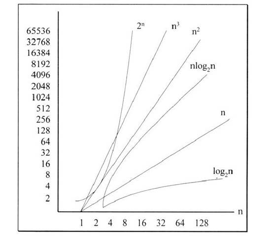

### 时间复杂度
算法的时间复杂度，用来度量算法的运行时间，以算法中频度最大的语句来度量，记作: T(n) = O(f(n))，它表示随着输入大小n的增大，算法执行需要的时间的增长速度可以用 f(n) 来描述。

**时间复杂度的计算**
如果一个算法的执行次数是 T(n)，那么只保留最高次项，同时忽略最高项的系数后得到函数 f(n)，此时算法的时间复杂度就是 O(f(n))，通常称为大O推导法。时间复杂度计算的一般法则如下：
- 一个顺序结构的代码，时间复杂度是O(1),对于一个for循环，假设循环次数为n, 循环体的时间复杂度为O(m),那么该循环的时间复杂度为O(n * m)。如下：
```
    func testFunc(_ n: Int) {
        for i in 0..<n {                // 循环次数：n
            print("index = \(i)")       // 循环体时间复杂度O(1)
        }
    }
```
    
    上述时间时间复杂度为O(n * 1)，即O(n).
- 嵌套循环时，假设循环体的时间复杂度为O(n),各个循环的循环次数为a、b、c...，那么该循环侧时间复杂度为O(n * a * b * c * ...)，分析时可由内向外分析：
```
    func testFunc(_ n: Int) {
        for i in 0..<n {                        // 循环次数 n
            for j in 0..<n{                     // 循环次数 n
                print("i = \(i) -->j = \(j)")   // 循环体时间复杂度O(1)
            }
        }
    }
```

此时时间复杂度为O(n * n x 1),即O(n^2)。
- 对于顺序执行的语句或算法，总的时间复杂度为其中最大的时间复杂度。
```
    func testFunc(_ n: Int) {
        // 第一部分时间复杂度为O(n^2)
        for i in 0..<n {                        // 循环次数 n
            for j in 0..<n{                     // 循环次数 n
                print("i = \(i) -->j = \(j)")   // 循环体时间复杂度O(1)
            }
        }
        // 第二部分时间复杂度为O(n)
        for i in 0..<n {                        // 循环次数：n
            print("index = \(i)")               // 循环体时间复杂度O(1)
        }
    }
```

此时时间复杂度为max(O(n^2),O(n))，即O(n^2).

- 对于条件判断语句，总的时间复杂度等于其中**时间复杂度最大的路径**的时间复杂度。
```
    func testFunc(_ n: Int) {
        if (n > 3) {
            // 第一条路径复杂度为O(n^2)
            for i in 0..<n {                        // 循环次数 n
                for j in 0..<n{                     // 循环次数 n
                    print("i = \(i) -->j = \(j)")   // 循环体时间复杂度O(1)
                }
            }
        } else {
            // 第二条路径时间复杂度为O(n)
            for i in 0..<n {                        // 循环次数：n
                print("index = \(i)")               // 循环体时间复杂度O(1)
            }
        }
    }
```

此时时间复杂度为max(O(n^2),O(n))，即O(n^2)。

- 二分查找的时间复杂度是O(logn)。

## 时间复杂度的增长率




### 空间复杂度
算法的空间复杂度是指在算法中所需要的辅助空间单元，而不包括问题的原始数据占用的空间。计算公式为：S(n)=O(f(n))，其中n为问题的规模，f(n)为语句关于n所占存储空间的函数。


## 推荐阅读
- [十分钟搞定时间复杂度](https://www.jianshu.com/p/f4cca5ce055a)
